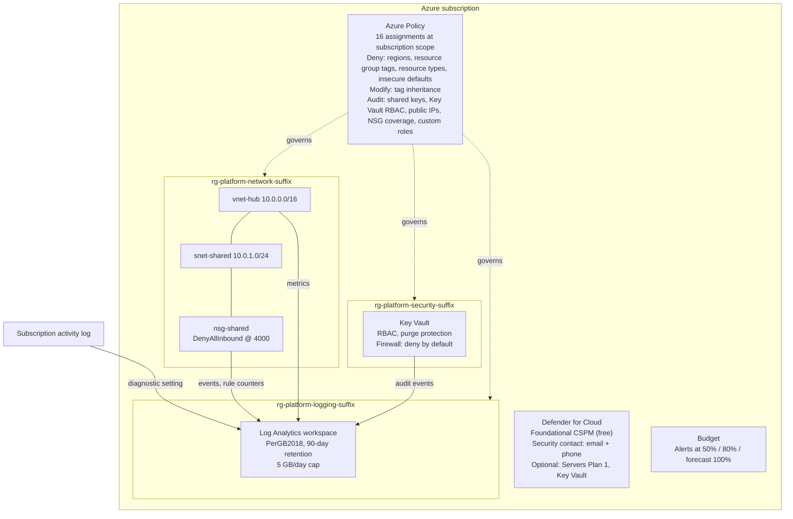

# 01 Secure Landing Zone

> Status: In progress \
> Clouds: Azure (Bicep, Terraform) \
> Requires: none \
> Last validated: not yet deployed

## In plain terms

**What this protects you from:** a cloud setup with no structure, no guardrails, and nobody sure who changed what. Without a landing zone, every new resource is a one-off decision made under time pressure, and the environment slowly becomes something nobody can explain or safely change.

**What it costs to run:** about **$1 to $65 per month** (estimate, see [section 9](#9-cost-breakdown)) for a typical small organization, almost all of it log storage. The figure scales with how much your systems log, not with headcount. The optional paid Defender plans add a per-server charge and are off by default.

**What you get:**

- A clear structure: three platform resource groups with a consistent naming convention, so anyone can tell what a resource is for by its name
- A permanent record of every change made in the subscription, kept for 90 days in one searchable place
- Guardrails that stop the most common mistakes before they happen: resources in the wrong region, missing ownership tags, insecure storage settings, and obsolete resource types
- A private network with a locked-down default, ready for servers or private endpoints later
- A secure place for platform secrets, with every access logged
- Budget alerts that reach a named person by email at 50 percent, 80 percent, and when the forecast exceeds 100 percent
- A security contact on file, so that Defender for Cloud alerts reach the same person once a Defender plan is turned on (an optional switch in this blueprint, off by default because the free tier does not generate alerts)

Every other Groundwork blueprint deploys into this one.

---

## 1. Overview

**Business objective.** Give a 50 to 500 person organization a cloud foundation that is secure by default, explainable to a non-technical owner, and cheap enough to run before any workload exists. The landing zone exists so that the first real workload (a file server, a line-of-business app, a backup target) lands somewhere governed rather than somewhere improvised.

**What gets deployed.** Into a single Azure subscription. `<suffix>` is `<orgCode>-<environment>-<regionShort>`, for example `contoso-prod-eus2`; the region short codes are listed in [docs/CONVENTIONS.md](../../docs/CONVENTIONS.md).

| Area | Resources |
|---|---|
| Structure | 3 resource groups: `rg-platform-logging-<suffix>`, `rg-platform-network-<suffix>`, `rg-platform-security-<suffix>` |
| Logging | 1 Log Analytics workspace `log-platform-<suffix>` (90-day retention, 5 GB/day cap); subscription activity log diagnostic setting |
| Governance | 16 Azure Policy assignments (built-in definitions only), 3 managed identities for tag inheritance, 3 role assignments |
| Network | 1 hub virtual network `vnet-hub-<suffix>` (`10.0.0.0/16`), 1 shared subnet `snet-shared` (`10.0.1.0/24`), 1 default-deny NSG `nsg-shared-<suffix>`, diagnostics to the workspace |
| Secrets | 1 Key Vault `kv-<orgCode>-<e>-<hash>` (RBAC model, purge protection, firewall default-deny), diagnostics to the workspace |
| Security | Defender for Cloud foundational CSPM (free tier), 1 security contact; Defender for Servers Plan 1 and Defender for Key Vault as an optional switch, off by default |
| Cost | 1 subscription budget `budget-subscription-<suffix>` with three alert thresholds |

**Architecture.** A single-subscription design. All platform services share one Log Analytics workspace. Policy is assigned at the subscription scope so it applies to every future resource group automatically. The hub network reserves address space for a VPN gateway and Azure Bastion without deploying either, so they can be added later without re-addressing anything.



### The policy catalog

All 16 assignments use built-in definitions and are named `lz-<what>`. Definition IDs are in `bicep/modules/policy.bicep` and `terraform/locals.tf`, verified against the Microsoft Learn built-in policy reference.

| Assignment | Built-in definition | Effect | Applies to | Why |
|---|---|---|---|---|
| `lz-allowed-locations` | Allowed locations | Deny | Every resource | Data residency and a smaller blast radius. Only the regions you listed. |
| `lz-allowed-rg-locations` | Allowed locations for resource groups | Deny | Resource groups | Same rule for the containers, so nothing can be created "elsewhere" by accident. |
| `lz-require-tag-owner` | Require a tag on resource groups | Deny | Resource groups | Every resource group names a person or team who owns it. |
| `lz-require-tag-environment` | Require a tag on resource groups | Deny | Resource groups | Every resource group says whether it is prod, nonprod or sandbox. |
| `lz-require-tag-costcenter` | Require a tag on resource groups | Deny | Resource groups | Every dollar traces to a cost center. |
| `lz-inherit-tag-owner` | Inherit a tag from the resource group if missing | Modify | Resources, on create or update | Resources pick up the owner tag from their group, so nobody has to tag each one. |
| `lz-inherit-tag-environment` | Inherit a tag from the resource group if missing | Modify | Resources, on create or update | Same for environment. |
| `lz-inherit-tag-costcenter` | Inherit a tag from the resource group if missing | Modify | Resources, on create or update | Same for cost center. |
| `lz-denied-resource-types` | Not allowed resource types | Deny | Every resource | Blocks classic (pre-ARM) resource types; extend the list for anything else that should never appear. |
| `lz-storage-secure-transfer` | Secure transfer to storage accounts should be enabled | Deny | Storage accounts | No storage account without HTTPS. |
| `lz-kv-purge-protection` | Key vaults should have deletion protection enabled | Deny | Key Vaults | No vault that an attacker or a mistake can permanently erase. |
| `lz-storage-no-shared-key` | Storage accounts should prevent shared key access | Audit | Storage accounts | Shows accounts still using account keys; move to Entra auth deliberately. |
| `lz-kv-rbac-model` | Azure Key Vault should use RBAC permission model | Audit | Key Vaults | Shows vaults still on legacy access policies. |
| `lz-nic-no-public-ip` | Network interfaces should not have public IPs | Deny definition, enforcement off (reports only) | Network interfaces | The only built-in for this check is Deny-only. Assigned in DoNotEnforce mode so it reports public-IP NICs without blocking a VM someone needs; switch to Default to enforce. |
| `lz-subnet-requires-nsg` | Subnets should be associated with a Network Security Group | AuditIfNotExists | Subnets | Shows subnets with no NSG, which Azure allows and attackers like. |
| `lz-audit-custom-rbac` | Audit usage of custom RBAC roles | Audit | Role definitions | Custom roles drift; built-in roles are reviewed by Microsoft. |

Tag inheritance applies when a resource is created or updated. Resources that already existed before the landing zone keep their missing tags until a remediation task runs; the validation checklist shows the command.

---

## 2. Prerequisites

| Requirement | Detail |
|---|---|
| Licensing | None beyond an Azure subscription. The free Defender tier is used unless you turn on `enableDefenderPlans`. |
| Roles | **Owner** at subscription scope for the deploying user or service principal. The Modify policy assignments create managed identities and role assignments, which Contributor cannot do. |
| Resource providers | `Microsoft.Security`, `Microsoft.Consumption`, `Microsoft.PolicyInsights`, `Microsoft.OperationalInsights`, `Microsoft.KeyVault`, `Microsoft.Network`, `Microsoft.Insights`. Register with `az provider register --namespace <name>` if `az provider show --namespace <name> --query registrationState` is not `Registered`. |
| Azure CLI | 2.60 or later. `az version` |
| Bicep CLI (Bicep path) | 0.30 or later. `az bicep install` then `az bicep version` |
| Terraform (Terraform path) | 1.9 or later, with the `hashicorp/azurerm` provider 4.35 or later (downloaded by `terraform init`). The provider needs a subscription ID; the steps below export `ARM_SUBSCRIPTION_ID` from your CLI login. |
| Earlier blueprints | None. This is the first one. |
| DNS or networking | None. The hub network is self-contained. `hubAddressSpace` must not overlap any on-premises range you may later connect. |
| Information to have ready | Organization code (2 to 8 lowercase letters or digits), security contact email and phone, monthly budget amount, allowed regions, tag values for owner, environment and costCenter, and optionally your office egress IP range for Key Vault access. |

**Terraform state.** State contains resource IDs and must never be committed. For a first sandbox run, local state is acceptable. For anything you will keep, create a storage account outside this blueprint and configure the `azurerm` backend in `terraform/versions.tf` before the first `init`.

## 3. Folder structure

```text
01-landing-zone/
├── README.md                          This guide
├── bicep/
│   ├── main.bicep                     Subscription-scope entry point: parameters, naming, Key Vault name, outputs
│   └── modules/
│       ├── logging.bicep              Log Analytics workspace
│       ├── activity-log.bicep         Subscription activity log export
│       ├── policy.bicep               16 policy assignments + tag inheritance identities
│       ├── network.bicep              Hub VNet, shared subnet, NSG, diagnostics
│       ├── keyvault.bicep             Platform Key Vault + diagnostics
│       ├── security.bicep             Defender CSPM, optional paid plans, security contact
│       └── budget.bicep               Subscription budget
├── terraform/
│   ├── versions.tf                    Provider pins, backend placeholder, provider features
│   ├── variables.tf                   Inputs with validation
│   ├── locals.tf                      Naming, Key Vault name, tags, policy definition IDs
│   ├── main.tf                        Resource groups, logging, network, Key Vault, security, budget
│   ├── policy.tf                      Policy assignments
│   └── outputs.tf
├── examples/
│   ├── main.example.bicepparam        Example Bicep parameters (fictional values)
│   └── terraform.example.tfvars       Example Terraform variables (fictional values)
└── diagrams/                          Reserved for exported diagrams; the source is the Mermaid block above
```

**Secret injection points.** None. This blueprint creates a Key Vault but stores nothing in it. Deployment credentials come from your Azure CLI login or, in CI, from OIDC federation. No file in this folder should ever contain a secret.

## 4. Deploy from zero

Both paths create the same resources with the same names, including the Key Vault. The one difference between them (the security contact's severity filter) is recorded in the design decisions. Pick one path; do not run both against the same subscription.

### Before either path

```bash
# 1. Sign in and select the target subscription
az login
az account set --subscription "<subscription name or ID>"
az account show --query "{name:name, id:id}" -o table

# 2. Confirm you hold Owner at subscription scope
az role assignment list --assignee "$(az ad signed-in-user show --query id -o tsv)" \
  --scope "/subscriptions/$(az account show --query id -o tsv)" \
  --query "[].roleDefinitionName" -o tsv
# Expected output includes: Owner

# 3. Register resource providers (idempotent; safe to re-run)
for ns in Microsoft.Security Microsoft.Consumption Microsoft.PolicyInsights \
          Microsoft.OperationalInsights Microsoft.KeyVault Microsoft.Network Microsoft.Insights; do
  az provider register --namespace "$ns"
done

# 4. Clone the repository and enter the blueprint
git clone https://github.com/IndigoWave-Tech/groundwork.git
cd groundwork/blueprints/01-landing-zone
```

### Option A: Bicep

```bash
# 5. Create your parameter file from the example. Keep the copy in examples/ so its
#    "using" line still finds bicep/main.bicep. The .local. name is git-ignored.
cp examples/main.example.bicepparam examples/main.local.bicepparam

# 6. Edit examples/main.local.bicepparam and replace EVERY value:
#    orgCode, environment, location, allowedLocations, tags, securityContactEmail,
#    securityContactPhone, monthlyBudgetAmount, keyVaultAllowedIpRanges, logRetentionDays,
#    logDailyQuotaGb, enableDefenderPlans. Leave hubAddressSpace and sharedSubnetPrefix
#    unless they overlap a range you plan to connect. deniedResourceTypes has a default.

# 7. Preview what will change. Read the output; nothing should be unexpected.
#    The parameter file names the template in its "using" line, so --template-file is not passed.
az deployment sub what-if \
  --name groundwork-lz \
  --location <your primary region> \
  --parameters examples/main.local.bicepparam

# 8. Deploy. Takes roughly 5 to 8 minutes.
az deployment sub create \
  --name groundwork-lz \
  --location <your primary region> \
  --parameters examples/main.local.bicepparam

# 9. Capture the outputs for the next blueprint
az deployment sub show --name groundwork-lz --query properties.outputs -o json
```

### Option B: Terraform

```bash
# 5. Create your variables file from the example. terraform.tfvars is git-ignored.
cp examples/terraform.example.tfvars terraform/terraform.tfvars

# 6. Edit terraform/terraform.tfvars and replace EVERY value (same list as above, snake_case).

# 7. Give the provider its subscription, then initialise.
#    For a kept environment, configure the backend in versions.tf first.
export ARM_SUBSCRIPTION_ID="$(az account show --query id -o tsv)"
cd terraform
terraform init

# 8. Preview. Expect 37 resources to add, 0 to change, 0 to destroy.
terraform plan -out=lz.tfplan

# 9. Apply the reviewed plan. Takes roughly 5 to 8 minutes.
terraform apply lz.tfplan

# 10. Capture the outputs for the next blueprint
terraform output -json
```

**Key Vault name.** The vault is named `kv-<orgCode>-<e>-<hash>`, where `<e>` is `p`, `n` or `s` for prod, nonprod or sandbox and `<hash>` is the last eight characters of your subscription ID. Both paths produce the same name. Key Vault names are global; if creation fails with a name conflict, a soft-deleted vault with the same name exists (yours from an earlier attempt, or another tenant's). Run `az keyvault list-deleted -o table`; recover yours with `az keyvault recover --name <keyVaultName>`, or wait out the retention period.

### Outputs

| Output (Bicep / Terraform) | Used by |
|---|---|
| `logAnalyticsWorkspaceId` / `log_analytics_workspace_id` | Blueprint 02 (`workspaceResourceId`), 03 (`workspace_resource_id`), 04 and 05 |
| `resourceGroupNames` / `resource_group_names` | Blueprint 05 (per-resource-group budgets) |
| `hubVnetId`, `sharedSubnetId` / `hub_vnet_id`, `shared_subnet_id` | Workload blueprints that place private endpoints or servers in the hub |
| `keyVaultName`, `keyVaultUri` / `key_vault_name`, `key_vault_uri` | Any blueprint that reads a platform secret; also used by the validation checklist below as `<keyVaultName>` |

## 5. Validation checklist

Run these after deployment. Each check is observable; if one fails, the deployment is not done. `<suffix>` is `<orgCode>-<environment>-<regionShort>`; `<keyVaultName>` is the `keyVaultName` output.

- [ ] **Resource groups exist with tags.** `az group list --query "[?starts_with(name,'rg-platform-')].{name:name, owner:tags.owner, env:tags.environment, cc:tags.costCenter}" -o table` shows three rows with all three tags populated.
- [ ] **Policy is assigned as designed.** `az policy assignment list --query "[?starts_with(name,'lz-')].{name:name, mode:enforcementMode}" -o table` shows 16 rows: 15 `Default` and `lz-nic-no-public-ip` as `DoNotEnforce`.
- [ ] **A denied region is actually denied.** `az group create --name rg-test-deny --location <a region NOT in allowedLocations> --tags owner=test environment=test costCenter=test` fails with `RequestDisallowedByPolicy`. If it succeeds, policy has not propagated yet (wait 10 minutes) or the assignment is wrong; delete the group with `az group delete --name rg-test-deny --yes`.
- [ ] **A missing tag is actually denied.** `az group create --name rg-test-deny --location <allowed region>` (no tags) fails with `RequestDisallowedByPolicy`.
- [ ] **Activity log reaches the workspace.** In the portal, open the Log Analytics workspace, run `AzureActivity | take 10`. Rows appear within 15 minutes of deployment. (The deployment itself generates activity.)
- [ ] **NSG is attached and denying.** `az network vnet subnet show -g rg-platform-network-<suffix> --vnet-name vnet-hub-<suffix> -n snet-shared --query networkSecurityGroup.id -o tsv` returns the NSG ID. `az network nsg rule list -g rg-platform-network-<suffix> --nsg-name nsg-shared-<suffix> --query "[?name=='DenyAllInbound'].priority" -o tsv` returns `4000`.
- [ ] **Key Vault is locked down.** `az keyvault show -n <keyVaultName> --query "{rbac:properties.enableRbacAuthorization, purge:properties.enablePurgeProtection, default:properties.networkAcls.defaultAction}" -o table` shows `True`, `True`, `Deny`.
- [ ] **Key Vault access is denied from an unlisted IP.** `az keyvault secret list --vault-name <keyVaultName>` from a machine not in `keyVaultAllowedIpRanges` fails with `ForbiddenByFirewall`. This is the expected result.
- [ ] **Security contact is set.** `az security contact list --query "[].{email:emails, phone:phone}" -o table` shows your contact.
- [ ] **Defender plans match the switch.** `az security pricing list --query "value[?name=='VirtualMachines' || name=='KeyVaults'].{plan:name, tier:pricingTier}" -o table` shows `Free` for both when `enableDefenderPlans` is false, `Standard` when true.
- [ ] **Budget exists.** `az consumption budget list --query "[].{name:name, amount:amount}" -o table` shows the budget at your amount.
- [ ] **Compliance view populates.** Within 30 minutes, Azure Portal > Policy > Compliance lists the `lz-` assignments. Initial state for the Audit assignments may be Non-compliant if the subscription already had resources; that is information, not a failure.
- [ ] **Existing resources get tags (only if the subscription had resources before).** `az policy remediation create --name inherit-owner --policy-assignment lz-inherit-tag-owner` (and the same for `environment` and `costcenter`), then check the resources' tags after the task completes.

## 6. Teardown

Teardown order matters because of purge protection, policy, and the managed identities behind the Modify assignments.

```bash
# 1. Remove the role assignments of the three tag-inheritance identities while
#    the policy assignments (and therefore the identities) still exist.
SUB="/subscriptions/$(az account show --query id -o tsv)"
for t in owner environment costcenter; do
  pid=$(az policy assignment show --name "lz-inherit-tag-$t" --query identity.principalId -o tsv)
  az role assignment delete --assignee "$pid" --role "Tag Contributor" --scope "$SUB"
done

# 2. Remove the policy assignments, or they may block cleanup of other resources.
for a in $(az policy assignment list --query "[?starts_with(name,'lz-')].name" -o tsv); do
  az policy assignment delete --name "$a"
done

# 3. Delete the budget and security contact (subscription-level, not in a resource group).
az consumption budget delete --budget-name budget-subscription-<suffix>
az security contact delete --name default

# 4. If you turned the paid Defender plans on, turn them off; they are billed per server, not per resource group.
az security pricing create --name VirtualMachines --tier Free
az security pricing create --name KeyVaults --tier Free

# 5. Delete the activity log diagnostic setting.
az monitor diagnostic-settings subscription delete --name send-activity-log-to-workspace --yes

# 6. Delete the resource groups. The Key Vault goes to soft-deleted state (90 days) and the
#    Log Analytics workspace to soft-deleted state (14 days); both still block a redeploy with the same name.
az group delete --name rg-platform-security-<suffix> --yes --no-wait
az group delete --name rg-platform-network-<suffix>  --yes --no-wait
az group delete --name rg-platform-logging-<suffix>  --yes --no-wait

# 7. If the validation step created rg-test-deny by mistake, delete it too.
az group delete --name rg-test-deny --yes --no-wait
```

**Terraform path:** `terraform destroy` handles steps 1 through 6. Because `prevent_deletion_if_contains_resources` is on, destroy will stop if something outside this configuration was created in a platform resource group; remove it first, deliberately.

**NetworkWatcherRG.** Azure creates a `NetworkWatcherRG` resource group the first time a virtual network is deployed in a region. It is not part of this blueprint and is not deleted here. The required-tag policy may deny its creation; if `az network watcher list` shows no watcher for your region after deployment, record that in the validation notes (a sandbox check, see production readiness).

**Purge protection.** The Key Vault cannot be purged for 90 days after deletion. This is intentional and cannot be overridden by this blueprint. If you redeploy within 90 days with the same `orgCode` and environment, recovery of the soft-deleted vault happens automatically on the Terraform path (`recover_soft_deleted_key_vaults = true`); on the Bicep path, run `az keyvault recover --name <keyVaultName>` first. The workspace can be recovered with `az monitor log-analytics workspace recover`.

## 7. Design decisions

| Decision | Chosen | Rejected | Why |
|---|---|---|---|
| Scope | Single subscription | Management group hierarchy (Enterprise-Scale / ALZ) | Most organizations in the target range have one subscription and no platform team. A management group tree adds a layer nobody will operate. The blueprint can be re-pointed at a management group later if the organization grows into it. |
| Policy effects | Deny for regions, resource group tags, denied resource types, storage HTTPS and Key Vault purge protection; Modify for tag inheritance; Audit for everything else | Deny everywhere | Deny on an existing subscription breaks running deployments. Audit first shows the drift; move each to Deny once the compliance view is clean. The region and tag denies only affect new resource groups and resources. |
| Public-IP NIC policy | Built-in Deny definition assigned with enforcement off | Enforce the Deny; or omit the check | The only built-in for this check has a fixed Deny effect. Enforcement off reports every public-IP NIC in the compliance view without blocking a VM someone legitimately needs. Switch to Default when the organization is ready to block. |
| Policy definitions | Built-in only | Custom definitions | Built-ins are maintained by Microsoft, understood by auditors, and need no explanation in a handover. Custom definitions are a maintenance liability for a small team. |
| Tag enforcement | Require 3 tags on resource groups, inherit to resources | Require tags on every resource | Requiring tags on individual resources breaks many portal and marketplace deployments. Requiring them on the resource group and inheriting gets the same cost visibility with far less friction. |
| Tag inheritance for existing resources | Modify on create or update; remediation task documented, not deployed | Remediation task in the blueprint | The blueprint targets a new subscription. On an existing one, run the remediation command in the validation checklist once; a managed remediation resource is churn for a one-time job. |
| Log retention | 90 days interactive | 30 days (cheaper) or 365 days (compliance) | 90 days covers the "what happened last quarter" question without paying for a year. Organizations with a regulatory retention requirement should raise it and budget for it. |
| Daily ingestion cap | 5 GB/day, parameter in both paths | No cap | A runaway log source can cost hundreds of dollars overnight. 5 GB/day is well above normal for this audience; raising it is a deliberate, visible act. |
| Hub network | Deployed, with address space reserved for gateway and Bastion | Not deployed until needed; or full hub with Azure Firewall | A VNet is free and re-addressing later is painful, so plan the space now. Azure Firewall Standard costs about $900 per month (estimate: list price of about $1.25 per hour, checked 2026-09-30) and is not justified before there is traffic to inspect. |
| NSG default | Explicit DenyAllInbound at priority 4000 | Rely on Azure default rules | Azure's defaults allow inbound from the internet to any public IP in the subnet. An explicit deny makes the intent visible and survives someone adding a public IP later. |
| Key Vault network access | Public endpoint, firewall default-deny, trusted Azure services bypass, optional IP allow-list | Private endpoint only (disable public access) | Private endpoints require a connected network (VPN, ExpressRoute, or a jump host) to use the vault at all. Most small organizations do not have that yet. Deny-by-default with a short IP list is the strongest posture that stays usable. Revisit when a VPN or Bastion exists. |
| Key Vault permission model | RBAC | Access policies | Access policies are the legacy model, bypass Azure RBAC, and are harder to audit. RBAC is the current Microsoft recommendation. |
| Key Vault name | `kv-<org>-<e>-<hash8>`, the hash being the last 8 hex characters of the subscription ID, identical in both paths | `kv-<org>-plat-<env>-<hash>` truncated to 24; per-language opaque hashes | The 24-character limit left no room for a hash with the long environment names, so `nonprod` and `sandbox` produced invalid names. The subscription ID is not a secret (it is in every resource ID), and both languages can derive the same 8 characters, so the two paths now name the vault the same. |
| Defender for Cloud | Foundational CSPM (free) always; Servers Plan 1 and Key Vault behind `enableDefenderPlans`, off by default | Paid plans always on; or no switch | Paid plans are per-resource cost with nothing to protect on day one. The switch exists because Defender security alerts (the rule in Blueprint 02's catalog) are generated only by paid plans; turning it on makes that alert live. Other plans (Storage, SQL, Containers) belong with the blueprint that deploys the resource. |
| Security contact in Terraform | Provider on/off switches | Match Bicep's Medium severity filter | The `azurerm` contact resource exposes `alert_notifications` and `alerts_to_admins` only. After a Terraform deployment, check the minimal severity in Defender for Cloud > Environment settings > Email notifications and adjust if it differs. This is the one difference between the two paths. |
| Terraform subscription context | `ARM_SUBSCRIPTION_ID` exported from the CLI login; provider 4.35 or later | A `subscription_id` variable | azurerm 4.x needs a subscription ID; from 4.35 it can take the CLI default. Exporting it keeps the configuration environment-free and the choice explicit. |
| Budget | One subscription budget, email alerts | Action groups, cost anomaly alerts, per-resource-group budgets | This is the minimum safety net. Blueprint 05 (Cost Guardrails) builds the full picture. Adding it here would duplicate that blueprint. |
| RBAC assignments for people | None | Assign Reader or Contributor to Entra groups | Identity is Blueprint 03. Hard-coding group object IDs here would make the landing zone environment-specific and couple two blueprints that should ship independently. |
| Naming | `<type>-<workload>-<org>-<env>-<region>` with a 12-region short-code map | Microsoft CAF abbreviations only | CAF resource type abbreviations are followed; the region map is explicit so names stay readable. Unknown regions fall back to the first four characters. The org code is normalized to lowercase in Bicep and validated in Terraform. |
| Terraform provider features | `prevent_deletion_if_contains_resources = true`, no Key Vault purge on destroy | Provider defaults | Both defaults favour convenience over safety. A landing zone should fail loudly before deleting something it did not create. |
| No `prevent_destroy` on the Key Vault | Purge protection, 90-day soft delete and the resource group deletion guard; the TFLint rule that asks for `prevent_destroy` is disabled in `.tflint.hcl` | `lifecycle { prevent_destroy = true }` | The teardown section promises that `terraform destroy` removes the blueprint, and Ready requires a sandbox deploy and teardown. `prevent_destroy` would fail that step until someone edits the code, while the vault's contents are already recoverable for 90 days. |

## 8. Security model

- **Identity and access.** The deploying identity needs Owner once, at deployment time. The blueprint creates three system-assigned managed identities (one per tag-inheritance policy) scoped to Tag Contributor only. No user or group assignments are created; see Blueprint 03.
- **Secrets.** None are created, stored, or required. The Key Vault is empty on delivery. Deployment authenticates through Azure CLI or OIDC federation in CI, never through a stored credential.
- **Network.** The shared subnet denies all inbound by default. No public IPs, gateways, or peering are created. Public-IP NICs elsewhere in the subscription are reported, not blocked, until you enforce that policy.
- **Logging and audit trail.** The subscription activity log (every control-plane action, with caller identity) and Key Vault audit events (every data-plane access attempt) are retained for 90 days in the workspace. NSG events and rule counters are retained for traffic analysis.
- **Alerts.** Budget alerts go to the security contact by email. Defender for Cloud security alerts are generated only by paid plans; with `enableDefenderPlans` off (the default) the contact receives none, and the Defender alert rule in Blueprint 02 stays dormant. Turn the switch on when the first servers arrive.
- **Data protection.** Key Vault soft delete (90 days) and purge protection are on and cannot be disabled after creation. Policy denies storage accounts without HTTPS and key vaults without purge protection anywhere in the subscription.
- **Known gaps, by design.** Paid Defender plans off by default, no private endpoints, no Sentinel, no Bastion, no VPN. Each is a later blueprint or a per-workload decision, and each is recorded in the design decisions table above.

## 9. Cost breakdown

| Resource | SKU or tier | Monthly estimate | Assumption |
|---|---|---|---|
| Log Analytics ingestion | PerGB2018 | $0 to $58 | Estimate: $2.30/GB after the first 5 GB per month free. $0 at under 170 MB/day; $58 at 1 GB/day (30 GB, 25 billable). |
| Log Analytics retention beyond 31 days | Interactive | $0 to $6 | Estimate: $0.10/GB/month for days 32 to 90. About $6 at 1 GB/day. |
| Key Vault | Standard | under $1 | Estimate: $0.03 per 10,000 operations. A platform vault with no workloads sees very few. |
| Virtual network, subnet, NSG | n/a | $0 | No charge for the resources themselves. Peering and gateways, not deployed here, would add cost. |
| Azure Policy | n/a | $0 | Built-in policy evaluation is free. |
| Defender for Cloud, foundational CSPM | Free tier | $0 | Free tier. |
| Defender for Servers Plan 1 (optional, off by default) | Standard, P1 | $0 by default; about $5 per server per month when on | Assumption: list price recalled as about $5 per server per month, billed hourly; the Defender for Cloud pricing page could not be fetched on 2026-10-03, so confirm there before turning the switch on. The landing zone itself has no servers. |
| Defender for Key Vault (optional, off by default) | Standard | $0 by default; cents per month when on | Assumption: billed per 10,000 vault transactions at a few cents; a platform vault with no workloads sees very few. Confirm on the pricing page. |
| Budget | n/a | $0 | Free. |
| Activity log export | n/a | $0 | Activity log ingestion to Log Analytics is not billed. |
| **Total, switch off** | | **about $1 to $65** | Estimate. Low end: a quiet subscription under the free ingestion allowance pays only Key Vault operations. High end: 1 GB/day of diagnostics. |
| Worst case under the daily cap | | about $365 | Estimate: 5 GB/day for 30 days is 150 GB, 145 billable at $2.30 plus retention. The cap exists so this is the ceiling, not an open-ended bill. |

Estimate method: list prices for US regions as published on Azure Monitor pricing, checked 2026-09-30, except the two Defender rows marked Assumption. Prices vary by region and change over time. Your Azure invoice is the source of truth; the budget alert exists so you see drift before the invoice does.

## 10. Production readiness

- [ ] CI checks pass (Bicep build and lint with zero warnings, PSRule, Checkov with documented skips, Terraform fmt and validate, TFLint)
- [ ] Deployed to a sandbox subscription (Bicep path)
- [ ] Deployed to a sandbox subscription (Terraform path)
- [ ] Validation checklist completed against both deployments
- [ ] Sandbox checks recorded: `NetworkWatcherRG` creation under the required-tag Deny, and whether Tag Contributor is accepted for the tag-inheritance remediation task (the built-in declares Contributor)
- [ ] Torn down cleanly with no orphaned resources
- [ ] Cost estimate confirmed against the sandbox invoice after 30 days, including the two Defender rows if the switch was tested

The blueprint moves to **Ready** when every box is checked.

## Changelog

| Date | Change |
|---|---|
| 2026-09-30 | Initial build: Bicep and Terraform implementations, guide, CI passing |
| 2026-10-03 | Review fixes: Key Vault name scheme (identical in both paths, valid for every environment); public-IP NIC policy assigned without enforcement; optional Defender plans switch; daily ingestion cap and tags as inputs in Bicep; policy catalog, outputs table, corrected counts and costs, scoped teardown; renamed from pattern to blueprint |
