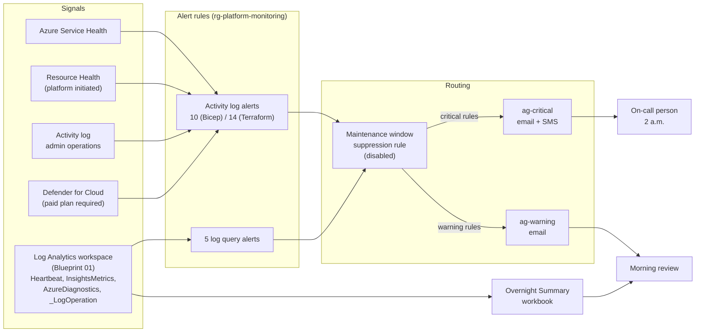

# 02 Overnight Watch

> Status: In progress \
> Clouds: Azure (Bicep, Terraform) \
> Requires: Blueprint 01 Secure Landing Zone (uses its Log Analytics workspace) \
> Last validated: not yet deployed

## In plain terms

**What this protects you from:** problems that start at 2 a.m. and are only discovered when staff arrive. A server that stopped overnight, a disk that filled up, an Azure outage in your region, or someone quietly changing permissions at midnight. Without this, the first alarm is a phone call from an employee who cannot work.

**What it costs to run:** about **$1 to $10 per month** (estimate, see [section 9](#9-cost-breakdown)) on a subscription with no servers yet, rising with the number of machines and disks the log rules watch: about $20 to $25 per month for ten servers. Most of the alerting is free; the cost is the log query rules and any SMS messages beyond the free allowance.

**What you get:**

- Two levels of alert. **Critical** means something is down or at risk right now, and a named person gets an email and a text. **Warning** means something needs attention in the morning, and it goes to email only. If everything pages, nothing does.
- Notice when Azure itself has a problem in your region, before your users tell you
- Notice when a machine stops reporting, a disk is nearly full, or the platform takes a resource down
- Notice when someone deletes a resource group, deletes a Key Vault, changes who has access, removes a guardrail, or changes the network boundary
- A one-screen morning summary: what changed, who changed it, what fired, which machines are healthy, and what is filling the logs
- A pre-built "maintenance mode" switch so planned patching does not generate a night of false alarms

Automation does the watching. A person responds only to escalations.

---

## 1. Overview

**Business objective.** Replace "we found out when someone complained" with "we knew before anyone noticed". For a 50 to 500 person organization without a night shift, the only affordable overnight coverage is automation that watches and a clear rule about when to wake someone up.

**What gets deployed.** Into a single Azure subscription that already has Blueprint 01. `<suffix>` is `<orgCode>-<environment>-<regionShort>`, the same value Blueprint 01 used.

| Area | Resources |
|---|---|
| Structure | 1 resource group `rg-platform-monitoring-<suffix>` |
| Routing | 2 action groups: `ag-critical-<suffix>` (email + optional SMS), `ag-warning-<suffix>` (email) |
| Platform health | 3 activity log alerts: service incidents, service maintenance, resource health |
| Change detection | 6 activity log alerts (Bicep) / 10 (Terraform, same coverage, see decisions): resource group deleted, Key Vault deleted, role assignment changed, policy assignment deleted, NSG or rule changed, diagnostic setting deleted |
| Security | 1 activity log alert: Defender for Cloud security alerts. Live only when Blueprint 01's `enableDefenderPlans` switch is on; the free Defender tier generates no alerts |
| Workload health | 5 log query alerts against the workspace: VM heartbeat missing, all heartbeats stopped, low disk space, repeated Key Vault denials, daily ingestion cap reached |
| Maintenance | 1 alert processing rule (suppression), deployed disabled |
| Review | 1 workbook: Overnight Summary |

20 resources on the Bicep path, 24 on the Terraform path (the difference is the split activity log alerts).

**Architecture.** Everything funnels through two action groups. Alert rules decide severity; action groups decide who hears about it. Activity log alerts need no agent and work the moment they are deployed. Log query alerts read the central workspace from Blueprint 01 and automatically cover any machine that is later onboarded to it, so adding a server never means adding alert rules.



Each rule is wired to one action group; the suppression rule, when enabled, removes the action groups from every alert that passes through it.

### The alert catalog

| Alert | Fires when | Severity | Why this severity |
|---|---|---|---|
| Service health incident | Azure reports an incident or security advisory in one of your regions, or globally | Critical | You cannot fix it, but you need to know before users call so you can communicate |
| Service health maintenance | Azure announces planned maintenance, action required, or an advisory | Warning | Plan for it in the morning |
| Resource health unavailable | The platform makes a resource Unavailable or Degraded (user-initiated stops are not alerted) | Critical | Something is down and nobody chose it |
| Resource group deleted | Any resource group deletion succeeds | Critical | Everything in it is gone; if unexpected, this is an incident |
| Key Vault deleted | Any Key Vault deletion succeeds | Critical | Soft delete protects the data, but secrets are now unreachable |
| Role assignment changed | A role is granted or removed | Warning | Legitimate often, but every one should be explainable |
| Policy assignment deleted | A policy assignment is removed | Warning | A landing zone guardrail may be gone |
| NSG or rule changed | Any NSG or security rule write or delete | Warning | The network boundary moved |
| Diagnostic setting deleted | Any diagnostic setting is removed | Warning | Something stopped logging |
| Defender security alert | Defender for Cloud raises an alert. Dormant until a paid Defender plan is on (Blueprint 01 `enableDefenderPlans`) | Critical | Treat every security alert as real until proven otherwise |
| VM heartbeat missing | A machine that reported in the last 24 hours has not done so for 10 minutes (configurable); stays active until it returns | Critical | The machine is off, disconnected, or the agent died |
| All heartbeats stopped | Machines that reported in the last day have all gone silent for 30 minutes | Critical (severity 1) | The workspace or agent configuration broke, not one machine |
| Low disk space | A disk is below 10 percent free (configurable) for two consecutive checks | Warning | Full disks take services down, but there is usually time |
| Key Vault access denied | More than 10 denied requests to one vault from one IP in 15 minutes | Warning | A broken application or someone probing |
| Daily cap reached | The workspace hit its ingestion cap and is dropping logs | Warning (severity 1) | You are blind until the cap resets; find the noisy source |

Activity log alerts have no display-name field, so they are named `ow-<what>` and their descriptions start with "Overnight Watch:", which is what the notification shows. Log query alerts carry the display name "Overnight Watch: <what>". "Critical" and "Warning" in this table mean the action group a rule is routed to; activity log alerts have no severity of their own.

## 2. Prerequisites

| Requirement | Detail |
|---|---|
| Licensing | None. All alert types used here are available on any subscription. |
| Roles | **Contributor** at subscription scope for the deploying identity (no role assignments are created here, so Owner is not required). |
| Resource providers | `Microsoft.Insights`, `Microsoft.AlertsManagement`, `Microsoft.OperationalInsights`. Register with `az provider register --namespace <name>`. |
| Azure CLI | 2.60 or later. |
| Bicep CLI (Bicep path) | 0.30 or later. |
| Terraform (Terraform path) | 1.9 or later, `hashicorp/azurerm` 4.35 or later. The provider needs a subscription ID; the steps below export `ARM_SUBSCRIPTION_ID` from your CLI login. |
| Earlier blueprints | Blueprint 01 deployed. You need its `logAnalyticsWorkspaceId` / `log_analytics_workspace_id` output; the command is in the deploy steps. |
| Information to have ready | Workspace resource ID; who is on call (email and mobile number); who reviews warnings; the display names of your Azure regions (for example `East US 2`, not `eastus2`); the same `orgCode`, `environment`, `location` and tag values as Blueprint 01. |
| For VM alerts to produce data | Virtual machines must run the Azure Monitor Agent with VM Insights enabled, sending to the Blueprint 01 workspace. This blueprint does not onboard machines; the blueprint that deploys a machine does. |
| For the Defender alert to produce data | A paid Defender plan must be on. Blueprint 01's `enableDefenderPlans` switch turns on Defender for Servers Plan 1 and Defender for Key Vault; until then the rule exists but never fires. |

## 3. Folder structure

```text
02-monitoring-alerting/
├── README.md                          This guide
├── bicep/
│   ├── main.bicep                     Subscription-scope entry point
│   └── modules/
│       ├── action-groups.bicep        Critical and warning action groups
│       ├── activity-alerts.bicep      Service health, resource health, admin changes, Defender
│       ├── log-alerts.bicep           Five scheduled query rules
│       ├── suppression.bicep          Disabled maintenance window rule
│       └── workbook.bicep             Overnight Summary workbook
├── terraform/
│   ├── versions.tf                    Provider pins, backend placeholder, provider features
│   ├── variables.tf                   Inputs with validation
│   ├── locals.tf                      Naming, tags, region list with Global
│   ├── main.tf                        Resource group, action groups, suppression, workbook
│   ├── activity-alerts.tf             Activity log alerts (for_each over a catalog)
│   ├── log-alerts.tf                  Scheduled query rules (for_each over a catalog)
│   └── outputs.tf
├── workbook/
│   └── overnight-summary.json         Workbook definition, shared by both paths
├── examples/
│   ├── main.example.bicepparam
│   └── terraform.example.tfvars
└── diagrams/                          Reserved for exported diagrams; the source is the Mermaid block above
```

**Secret injection points.** None. Email addresses and phone numbers in action groups are contact details, not secrets, but they are environment-specific and belong only in your local parameter file.

## 4. Deploy from zero

Both paths create the same coverage; the Terraform path has four more activity log alert resources because the provider models one operation per rule. Pick one path; do not run both against the same subscription.

### Before either path

```bash
# 1. Sign in and select the subscription that holds Blueprint 01
az login
az account set --subscription "<subscription name or ID>"

# 2. Register resource providers (idempotent)
for ns in Microsoft.Insights Microsoft.AlertsManagement Microsoft.OperationalInsights; do
  az provider register --namespace "$ns"
done

# 3. Clone the repository (skip if you already have it) and enter the blueprint
git clone https://github.com/IndigoWave-Tech/groundwork.git
cd groundwork/blueprints/02-monitoring-alerting

# 4. Get the workspace ID from Blueprint 01. Bicep path:
az deployment sub show --name groundwork-lz \
  --query properties.outputs.logAnalyticsWorkspaceId.value -o tsv
# Terraform path (run from this folder):
terraform -chdir=../01-landing-zone/terraform output -raw log_analytics_workspace_id
```

### Option A: Bicep

```bash
# 5. Create your parameter file from the example. Keep the copy in examples/ so its
#    "using" line still finds bicep/main.bicep. The .local. name is git-ignored.
cp examples/main.example.bicepparam examples/main.local.bicepparam

# 6. Edit examples/main.local.bicepparam: workspaceResourceId, criticalEmails,
#    criticalSmsReceivers, warningEmails, serviceHealthRegions (display names),
#    and orgCode, environment, location and tags to match Blueprint 01.

# 7. Preview, then deploy. The parameter file names the template in its "using"
#    line, so --template-file is not passed.
az deployment sub what-if \
  --name groundwork-ow \
  --location <your primary region> \
  --parameters examples/main.local.bicepparam

az deployment sub create \
  --name groundwork-ow \
  --location <your primary region> \
  --parameters examples/main.local.bicepparam

# 8. Capture the outputs for Blueprints 04 and 05
az deployment sub show --name groundwork-ow --query properties.outputs -o json
```

### Option B: Terraform

```bash
# 5. Create your variables file from the example. terraform.tfvars is git-ignored.
cp examples/terraform.example.tfvars terraform/terraform.tfvars

# 6. Edit terraform/terraform.tfvars with the same values (snake_case).

# 7. Give the provider its subscription, then initialise.
#    For a kept environment, configure the backend in versions.tf first
#    (same storage account as Blueprint 01, key groundwork/02-monitoring-alerting.tfstate).
export ARM_SUBSCRIPTION_ID="$(az account show --query id -o tsv)"
cd terraform
terraform init

# 8. Preview. Expect 24 resources to add, 0 to change, 0 to destroy.
terraform plan -out=ow.tfplan

# 9. Apply the reviewed plan.
terraform apply ow.tfplan

# 10. Capture the outputs for Blueprints 04 and 05
terraform output -json
```

**Confirm the SMS subscription.** Azure sends a confirmation text to each SMS recipient. Until they reply, SMS is not delivered. Check in the portal under the action group's SMS receiver status.

### Outputs

| Output (Bicep / Terraform) | Used by |
|---|---|
| `criticalActionGroupId` / `critical_action_group_id` | Blueprint 04 (backup failure alerts) and Blueprint 05 (hard ceiling budget), as their critical action group input |
| `warningActionGroupId` / `warning_action_group_id` | Blueprint 05 (per-resource-group budgets, anomaly alerts), as its warning action group input |
| `resourceGroupName` / `resource_group_name` | Blueprint 05, if it adds a budget for this resource group |
| `workbookId`, `suppressionRuleId` / `workbook_id`, `maintenance_suppression_rule_id` | Reference only: the portal links and the maintenance switch |

## 5. Validation checklist

`<suffix>` is `<orgCode>-<environment>-<regionShort>`, for example `contoso-prod-eus2`.

- [ ] **Action groups exist with the right receivers.** `az monitor action-group list -g rg-platform-monitoring-<suffix> --query "[].{name:name, emails:length(emailReceivers), sms:length(smsReceivers)}" -o table` shows `critical` with your counts and `warning` with email only.
- [ ] **Test notification reaches the on-call person.** In the portal, open `ag-critical-<suffix>` and use **Test action group** with a sample Activity Log alert. Confirm the email arrives and the SMS arrives. Do the same for `ag-warning-<suffix>`.
- [ ] **All activity log alerts are enabled.** `az monitor activity-log alert list -g rg-platform-monitoring-<suffix> --query "[].{name:name, enabled:enabled}" -o table` shows every `ow-` rule as `True`: 10 rows on the Bicep path, 14 on the Terraform path.
- [ ] **Global is in the service health scope.** `az monitor activity-log alert show -g rg-platform-monitoring-<suffix> -n ow-service-health-incident --query "condition.allOf[?field=='properties.impactedServices[*].ImpactedRegions[*].RegionName'].containsAny" -o json` lists your regions and `Global`.
- [ ] **A real change triggers an alert.** Create and delete a test NSG: `az network nsg create -g rg-platform-network-<suffix> -n nsg-ow-test -l <region> --tags owner=test environment=test costCenter=test` then `az network nsg delete -g rg-platform-network-<suffix> -n nsg-ow-test`. Within 5 minutes the warning email arrives: one "NSG or rule changed" email on the Bicep path, an "NSG written" and an "NSG deleted" email on the Terraform path. (Policy from Blueprint 01 requires the tags.)
- [ ] **Log query alerts are enabled and valid.** `az monitor scheduled-query list -g rg-platform-monitoring-<suffix> --query "[].{name:name, enabled:enabled, freq:evaluationFrequency}" -o table` shows five rules, all enabled. If deployment had failed query validation, they would not exist.
- [ ] **Suppression rule exists and is disabled.** `az monitor alert-processing-rule list -g rg-platform-monitoring-<suffix> --query "[].{name:name, enabled:properties.enabled}" -o table` shows `apr-maintenance-window-<suffix>` as `False`.
- [ ] **Workbook opens.** Portal > Monitor > Workbooks > Overnight Summary (also listed under the workspace's Workbooks blade). Sections 2, 3 and 5 populate from Blueprint 01's activity log and usage data. Sections 4 and 6 are empty until VMs or Key Vault traffic exist; that is expected. Record whether section 1 populates after an alert fires (a sandbox check, see production readiness).
- [ ] **Service health region names are right.** Open `ow-service-health-incident` in the portal and confirm the regions listed match where you actually run resources. A typo here means silence during an outage.
- [ ] **Heartbeat alert resolves correctly (once a VM exists).** Stop a test VM for longer than `heartbeatMissingMinutes`; the critical alert fires and stays active. Start the VM; the alert resolves within two evaluations.

## 6. Teardown

```bash
# Everything lives in one resource group. Deleting it removes all alerts, action
# groups, the suppression rule, and the workbook. Nothing has soft delete.
az group delete --name rg-platform-monitoring-<suffix> --yes
```

**Terraform path:** `terraform destroy`. Because `prevent_deletion_if_contains_resources` is on, destroy stops if something this configuration does not manage was created in the resource group; remove it first, deliberately.

Blueprint 01's workspace is untouched; this blueprint only reads from it.

## 7. Design decisions

| Decision | Chosen | Rejected | Why |
|---|---|---|---|
| Two severities | Critical (email + SMS) and Warning (email) | One action group; or four or five severity tiers | Two is the number a one-person IT function can honour. Critical means wake up; warning means morning. More tiers get ignored. |
| Activity log alerts first | 10 activity log alerts (Bicep; 14 on Terraform) covering platform health and admin changes | Only log query alerts | Activity log alerts are free, need no agent, and work on an empty subscription. They are the day-one coverage. |
| Alert naming | Log query alerts carry the display name "Overnight Watch: <what>"; activity log alerts are named `ow-<what>` with "Overnight Watch:" in the description | Spaces and colons in activity log alert resource names | The activity log alert resource type has no display-name field, and its resource name cannot carry a colon. The description is what the notification email shows, so the prefix lives there. |
| Admin change alerts as Warning | Role, policy, NSG and diagnostics changes are Warning | Critical for all security-relevant changes | These are usually legitimate. Paging someone for every role assignment trains them to ignore pages. The exception is deletion of a resource group or Key Vault, which is Critical because it is rarely routine. |
| Resource Health scope | Subscription-wide, Unavailable or Degraded, platform-initiated only | Any cause, including user-initiated | A deliberate stop or deallocate is user-initiated; paging the on-call person for it is noise. Platform-initiated means Azure took the resource down. One rule covers every current and future resource. |
| Service health regions | Your regions plus Global, added automatically in both paths | Validate that the input contains Global | Tenant-wide incidents (identity, portal, DNS) are reported against Global. Adding it by construction means a typo cannot silence them, and Bicep and Terraform behave the same. |
| Defender security alert | One activity log alert on the Security category, present from day one | Omit until a paid plan exists | The rule is free and ready. It is dormant until Blueprint 01's `enableDefenderPlans` is on, because Defender security alerts are generated only by paid plans; the catalog says so rather than implying coverage. |
| VM alerts via Heartbeat and InsightsMetrics | Workspace-scoped log query rules | Per-VM metric alerts | Workspace-scoped rules automatically cover every machine onboarded to the workspace. Adding a server never means adding alert rules, which is the only way a small team keeps coverage complete. The cost is a dependency on the Azure Monitor Agent, and billing per machine (see cost). |
| Heartbeat threshold | 10 minutes, configurable 5 to 60 | 5 minutes | Heartbeats arrive every minute; 10 minutes tolerates a reboot without paging. |
| Heartbeat rule window | 24 hours, evaluated every 5 minutes | Window equal to the threshold | With a short window, a machine that stays down leaves the query and the alert auto-resolves while it is still down, and any threshold of 30 minutes or more can never fire. The 24-hour window keeps the alert active until the machine returns. The workbook uses the same threshold. |
| Two heartbeat rules | Per-machine gap plus "everything went silent" | One rule | They point to different causes. One silent machine is a machine problem. Every machine silent is a workspace, agent or network problem, and the response is different. |
| Low disk at 10 percent, two consecutive checks | Warning | Critical, or 5 percent | At 10 percent there is time to act in the morning. Requiring two checks avoids paging on a transient temp file. |
| Key Vault denial threshold | More than 10 in 15 minutes, per vault per caller IP | Any denial | One denial is a typo. Ten from one address is either a broken application or someone probing, and either deserves a look in the morning. |
| Daily cap alert | Severity 1 warning | Critical | Nothing is down, but you are blind. It needs attention the same day, not at 2 a.m. The query follows the Microsoft Learn sample for this event. |
| Suppression rule deployed disabled | One subscription-wide rule, no schedule | No rule; or a scheduled recurring window | A pre-built switch means the person patching at midnight flips a toggle instead of improvising. No schedule because maintenance windows vary; add one if yours is fixed. |
| Watching the watchers | Not alerted on | Alerts on alert rule or action group deletion, or on the suppression rule being enabled | Known gap. The Overnight Summary's change list shows these operations, and the validation checklist confirms the suppression rule is off. Rules that alert on their own deletion are easy to add; they are left out of the baseline to keep the catalog short. |
| Workbook over a dashboard | One shared workbook, definition in a JSON file both paths load | Azure dashboard; Grafana | Workbooks are free, versionable as JSON, and support KQL directly. Grafana is excellent and costs money with nothing yet to justify it. |
| Terraform activity alerts | 14 rules via `for_each`, one operation per rule | 10 rules matching Bicep exactly | The `azurerm` provider models one `operation_name` per criteria block, where ARM accepts `anyOf`. Splitting keeps the provider happy; coverage is identical. Both paths are documented as what they are. |
| Terraform state and provider | Commented backend block with key `groundwork/02-monitoring-alerting.tfstate`; `prevent_deletion_if_contains_resources` on; azurerm 4.35 or later with `ARM_SUBSCRIPTION_ID` exported | Provider defaults | Same conventions as Blueprint 01, so the two configurations are operated the same way. |
| No auto-remediation runbooks | Not included | Automation account with restart-on-heartbeat-loss runbook | Blueprint 02's original scope listed remediation runbooks. They were removed: there are no workloads yet to remediate, a runbook that restarts machines unattended is a decision to make per workload, and building it now would be solving a problem that does not exist. It returns when a workload blueprint needs it. |
| No Microsoft Sentinel | Not included | Sentinel on the workspace | Sentinel is a SIEM with per-GB pricing and needs someone to triage incidents. Right-sized for this audience later, not on day one. |

## 8. Security model

- **Identity and access.** No identities, role assignments, or secrets are created. Deployment needs Contributor.
- **Contact details.** Email addresses and phone numbers live in action groups, which anyone with Reader on the resource group can see. They are contact details, not credentials, but keep the parameter file out of version control.
- **Suppression rule risk.** An enabled suppression rule silences everything. The validation checklist confirms it is disabled; the Overnight Summary workbook's change list shows the enabling operation and an unusually quiet night is itself a signal.
- **Known gaps, by design.** Deleting or disabling an alert rule or an action group is not alerted on (see design decisions). The Defender alert is dormant until a paid plan is on. Neither gap is silent: the first shows in the workbook's change list, the second is stated in the catalog.
- **Logging.** Alert rule changes are themselves activity log events and appear in the workbook's change list.

## 9. Cost breakdown

| Resource | SKU or tier | Monthly estimate | Assumption |
|---|---|---|---|
| Activity log alerts | 10 (Bicep) or 14 (Terraform) | $0 | Estimate: activity log alert rules are free to create and evaluate (Microsoft Learn, Azure Monitor alert types). |
| Log query alert rules | 5 rules, billed per time series | about $1 to $8 with no servers; about $20 to $25 with ten servers | Assumption: Azure Monitor bills log search alerts per rule at a rate set by evaluation frequency, and a rule split by dimensions is billed once per time series it produces (Microsoft Learn, "Choose the right type of alert rule"). Three of the five rules split by computer, disk or caller IP, so cost grows with the estate. Recalled list rates of about $0.50 per time series per month at 15-minute frequency and about $1.00 at 5-minute were not confirmed from the pricing page on 2026-10-03. Worked example, ten VMs with two disks each: heartbeat rule 10 series at 5 minutes, about $10; disk rule 20 series at 15 minutes, about $10; the other three rules a few series, about $2. |
| Action groups | 2 | $0 | Estimate: no charge for the groups themselves. |
| Email notifications | varies | $0 | Estimate: first 1,000 emails per month are free (Microsoft Learn). A quiet month uses a handful. |
| SMS notifications | varies | $0 to $2 | Assumption: a small per-message charge after a monthly free allowance of 10 messages, at US rates of a few cents per message. Critical alerts should be rare, so this is near zero unless something is badly wrong. |
| Alert processing rule | 1 | $0 | Estimate: free. |
| Workbook | 1 | $0 | Estimate: free. Queries run against data already paid for in Blueprint 01. |
| **Total** | | **about $1 to $10 with no servers; about $20 to $25 with ten** | Dominated by the log query rules, which scale with machines and disks. |

Estimate method: Microsoft Learn documentation on alert pricing categories and free quotas, checked 2026-10-01; the per-time-series billing rule confirmed on Learn on 2026-10-03. Per-rule and per-message rates are marked Assumption because the pricing page could not be fetched; confirm them in the Azure pricing calculator for your region. Your Azure invoice is the source of truth.

## 10. Production readiness

- [ ] CI checks pass (Bicep build and lint with zero warnings, PSRule, Terraform fmt and validate, TFLint, Checkov)
- [ ] Deployed to a sandbox subscription (Bicep path)
- [ ] Deployed to a sandbox subscription (Terraform path)
- [ ] Test notifications received on both action groups, SMS confirmed
- [ ] Validation checklist completed, including the real NSG change test and the heartbeat resolve test
- [ ] Sandbox check recorded: whether workbook section 1 (alerts fired) populates from the activity log after an alert fires
- [ ] Torn down cleanly
- [ ] Per-time-series log alert cost confirmed from the sandbox invoice

The blueprint moves to **Ready** when every box is checked.

## Changelog

| Date | Change |
|---|---|
| 2026-10-01 | Initial build: Bicep and Terraform implementations, workbook, guide, CI passing. Auto-remediation runbooks removed from scope (see design decisions). |
| 2026-10-03 | Review fixes: heartbeat rule keeps firing while a machine is down; Resource Health limited to platform-initiated events; Global added to the service health scope by construction; Terraform backend block, deletion guard and provider floor; "Overnight Watch:" on every alert; Defender alert documented as dormant until Blueprint 01's plans switch is on; workbook threshold follows the heartbeat parameter; outputs step for Blueprints 04 and 05; corrected counts; per-time-series cost model; renamed from pattern to blueprint |
