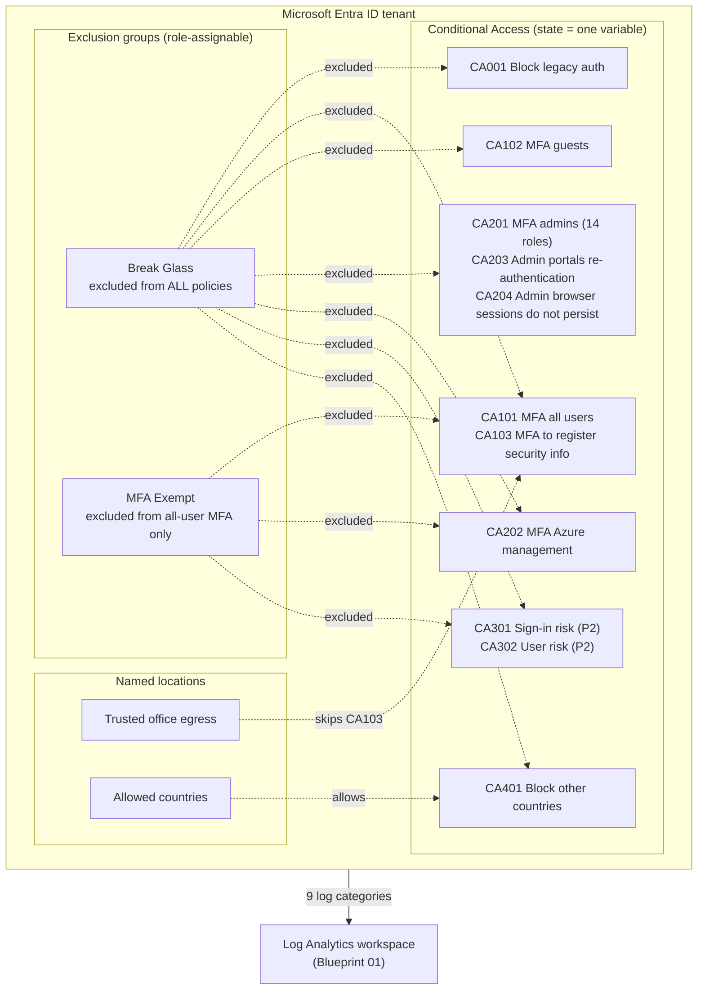

# 03 Identity Baseline

> Status: In progress \
> Clouds: Microsoft Entra ID (Terraform). No Bicep: see [bicep/README.md](bicep/README.md) for why. \
> Requires: Microsoft Entra ID P1 (included in Microsoft 365 Business Premium, E3, E5). Blueprint 01 optional, for log export. \
> Last validated: not yet deployed

## In plain terms

**What this protects you from:** stolen passwords, risky sign-ins, and accounts that outlive the people who used them. Most business email compromise starts with one password, phished or guessed, used from somewhere your staff have never been. This blueprint makes a password alone insufficient, closes the old protocols that attackers use to sidestep MFA, and keeps a locked-and-documented emergency key so you can never be locked out of your own tenant.

**What it costs to run:** **$0** beyond licensing you already have. Conditional Access is part of Entra ID P1, which Microsoft 365 Business Premium includes. The optional risk-based policies need P2.

**What you get:**

- Every sign-in requires a second factor, with a short, reviewed list of exceptions
- Administrators are held to a higher standard: MFA everywhere, admin portal sessions that expire, and browser sessions that never stay signed in
- Legacy email protocols (the ones that cannot do MFA) are blocked
- An attacker who steals a password cannot register their own phone as the second factor
- Optional: sign-ins from countries where you have no staff are blocked
- Two emergency "break-glass" accounts that bypass every rule, held in groups that only your most senior administrators can change, so a misconfiguration can never lock out the business
- Every policy starts in **report-only mode**: it records what it *would* have done for a week or more before it is turned on, so you see the impact before anyone is affected

---

## 1. Overview

**Business objective.** Make identity the perimeter. For a 50 to 500 person organization on Microsoft 365, the firewall is mostly irrelevant; the attack surface is the login page. This blueprint applies Microsoft's own recommended baseline policies as code, with a safe rollout procedure and the exclusions that stop a mistake from becoming an outage.

**What gets deployed.** Into a Microsoft Entra ID tenant:

| Area | Resources |
|---|---|
| Exclusion groups | 2 role-assignable security groups: break-glass exclusions, MFA-exempt accounts |
| Named locations | Trusted office egress IPs (optional), allowed countries (optional) |
| Conditional Access, always | 8 policies: CA001, CA101, CA102, CA103, CA201, CA202, CA203, CA204 |
| Conditional Access, P2 only | 2 policies: CA301, CA302 (when `enable_risk_policies = true`) |
| Conditional Access, optional | 1 policy: CA401 (when `allowed_countries` is set) |
| Log export | Nine Entra log categories (sign-in, audit and risk) to the Blueprint 01 workspace (optional) |

**Architecture.** Policies target the whole tenant and exclude groups, never individual users, so changing who is exempt never means changing a policy. Two exclusion groups exist because two different questions are being asked: "who must bypass everything in an emergency" (break-glass, excluded from all policies) and "who genuinely cannot perform MFA" (service accounts, excluded from MFA requirements only, still blocked from legacy authentication). Both groups are role-assignable, so only Privileged Role Administrators, Global Administrators and the groups' owner (the deploying identity) can change their membership. Every policy's state is one variable, so the whole baseline moves from report-only to enforced in a single reviewed change.

Unlike the Azure blueprints, this one takes no `environment`, `location` or `tags` inputs: Conditional Access objects live in the tenant, not in a subscription or region, and carry no tags. `org_code` still prefixes every group and named-location name so they sort together.



### The policy catalog

| Policy | Who | What | Exclusions | Why |
|---|---|---|---|---|
| CA001 Block legacy authentication | All users | Block Exchange ActiveSync and "other clients" (IMAP, POP3, SMTP AUTH, older Office) | Break-glass only | Legacy protocols cannot do MFA, so they are the bypass attackers reach for first. No exemptions: if a device needs legacy auth, fix the device. |
| CA101 Require MFA for all users | All users, all apps | Require MFA | Break-glass, MFA-exempt | The single most effective control against password compromise. |
| CA102 Require MFA for guests | All external user types | Require MFA | Break-glass | Redundant with CA101 today, so that guest MFA survives if CA101 is ever relaxed for staff. |
| CA103 Require MFA to register security info | All users, except from trusted locations | Require MFA | Break-glass, MFA-exempt, guests | Stops an attacker with a stolen password from enrolling their own authenticator. Trusted office IPs are excluded so new hires can register on day one. Every location marked trusted in the tenant counts, not only the one this blueprint creates. |
| CA201 Require MFA for administrators | 14 admin roles, all apps | Require MFA | Break-glass only | Microsoft's own role list. The MFA-exempt group does not apply to admins, on purpose. |
| CA202 Require MFA for Azure management | All users accessing the Azure Resource Manager API | Require MFA | Break-glass, MFA-exempt | Covers portal, CLI, PowerShell. A compromised account with Azure access can delete the business. |
| CA203 Admin portals: periodic re-authentication | 14 admin roles, Microsoft admin portals and Azure management | Sign-in frequency 4 hours (configurable) | Break-glass only | A stolen admin session on a shared machine is worth far less when it expires. |
| CA204 Admin browser sessions do not persist | 14 admin roles, all apps | Persistent browser session never ("stay signed in" is not offered) | Break-glass only | Microsoft requires this control to target all resources, so it cannot share CA203's app list. Ordinary users keep persistent sessions. |
| CA301 Sign-in risk (P2) | All users, medium or high sign-in risk | Require MFA, every time the risk is detected | Break-glass, MFA-exempt | Identity Protection flags impossible travel, anonymous IPs, leaked credentials. |
| CA302 User risk (P2) | All users, high user risk | Require MFA and password change, every time | Break-glass, MFA-exempt | A user whose credentials are confirmed leaked changes their password on next sign-in. |
| CA401 Block other countries | All users from any location not in the allowed list, including unknown | Block | Break-glass only | If nobody works from there, nobody should sign in from there. Travelling staff need a documented exception process. |

## 2. Prerequisites

| Requirement | Detail |
|---|---|
| Licensing | Microsoft Entra ID P1 for every user subject to Conditional Access. Business Premium, E3 and E5 include it. P2 (E5, or add-on) for CA301 and CA302. |
| Security defaults | Must be **off**. Conditional Access and security defaults cannot coexist. Entra admin center > Identity > Overview > Properties > Manage security defaults. |
| Two break-glass accounts | Create them **before** deploying. Cloud-only (`*.onmicrosoft.com`), Global Administrator, no MFA registered, 64+ character passwords stored offline in two separate physical locations (a safe, not a password manager). Record each account's **object ID**. See the [Microsoft guidance](https://learn.microsoft.com/entra/identity/role-based-access-control/security-emergency-access). |
| Deploying identity | A user holding **Conditional Access Administrator** and **Privileged Role Administrator**. The second is needed because the exclusion groups are role-assignable, which only Global Administrators and Privileged Role Administrators can create. Global Administrator also works but is more than needed. If using a service principal, Graph permissions `Policy.ReadWrite.ConditionalAccess`, `Policy.Read.All` and `Group.ReadWrite.All`, plus `RoleManagement.ReadWrite.Directory` for the role-assignable groups. |
| For log export | Contributor on the Blueprint 01 workspace resource group, and the deploying identity must be Global Administrator or Security Administrator (Entra diagnostic settings are tenant-level). The `azurerm` provider takes its subscription from `workspace_resource_id`; nothing else is needed. |
| Azure CLI | 2.60 or later, signed in to the correct tenant: `az login --tenant <tenant-id>`. Add `--allow-no-subscriptions` only when the tenant has no Azure subscription at all (a tenant-only run with no log export). |
| Terraform | 1.9 or later. Providers: `hashicorp/azuread` 3.x, `hashicorp/azurerm` 4.35 or later. When `workspace_resource_id` is null, the `azurerm` provider takes the subscription from your CLI login (`az account show`) or from `ARM_SUBSCRIPTION_ID`; it creates nothing there. |
| Information to have ready | Break-glass object IDs; any accounts that truly cannot do MFA and the reason for each; office egress IPs; countries staff sign in from; whether the tenant has P2. |

**Finding object IDs.** `az ad user show --id breakglass1@contoso.onmicrosoft.com --query id -o tsv`

**MFA registration.** Before moving CA101 from report-only to enabled, every user needs a registered MFA method or they will be prompted to register at next sign-in, which is acceptable for most organizations but should be communicated. Check registration status: Entra admin center > Protection > Authentication methods > User registration details.

**Hybrid tenants.** If Entra Connect or Cloud Sync is in use, the directory synchronization account cannot perform MFA; Microsoft's Conditional Access deployment guidance names it as an account to exclude. Add its object ID to `service_account_object_ids` before enabling CA101, and check the report-only data for `reportOnlyFailure` rows against it. CA001 still applies to it; if the report-only data shows legacy-authentication failures for the sync account, investigate before enabling CA001.

## 3. Folder structure

```text
03-identity-baseline/
├── README.md                          This guide
├── bicep/
│   └── README.md                      Why this blueprint has no Bicep
├── terraform/
│   ├── versions.tf                    Provider pins, subscription context, backend block, required permissions
│   ├── variables.tf                   Inputs with validation (two break-glass IDs enforced)
│   ├── locals.tf                      Role template IDs, app IDs, exclusion sets
│   ├── main.tf                        Exclusion groups, named locations, log export
│   ├── conditional-access.tf          The eleven policies
│   └── outputs.tf
├── examples/
│   └── terraform.example.tfvars
└── diagrams/
```

**Secret injection points.** None. Object IDs and IP ranges are not secrets but are tenant-specific; keep `terraform.tfvars` out of version control. Terraform state contains the same IDs; store it in the protected backend from Blueprint 01 by uncommenting the backend block in `versions.tf`.

## 4. Deploy from zero

### Step 0: Create the break-glass accounts (once, by hand)

This is deliberately manual. Terraform would put the passwords in state.

```bash
az login --tenant <tenant-id>     # add --allow-no-subscriptions if the tenant has no Azure subscription

# Create two accounts. Use long random passwords generated offline; do not paste them into a terminal history.
az ad user create --display-name "Emergency Access 1" --user-principal-name breakglass1@<tenant>.onmicrosoft.com --password '<64+ char password>' --force-change-password-next-sign-in false
az ad user create --display-name "Emergency Access 2" --user-principal-name breakglass2@<tenant>.onmicrosoft.com --password '<64+ char password>' --force-change-password-next-sign-in false

# Assign Global Administrator (role template 62e90394-69f5-4237-9190-012177145e10)
for upn in breakglass1 breakglass2; do
  az rest --method POST --url "https://graph.microsoft.com/v1.0/roleManagement/directory/roleAssignments" \
    --body "{\"principalId\":\"$(az ad user show --id ${upn}@<tenant>.onmicrosoft.com --query id -o tsv)\",\"roleDefinitionId\":\"62e90394-69f5-4237-9190-012177145e10\",\"directoryScopeId\":\"/\"}"
done

# Record the object IDs for terraform.tfvars
az ad user show --id breakglass1@<tenant>.onmicrosoft.com --query id -o tsv
az ad user show --id breakglass2@<tenant>.onmicrosoft.com --query id -o tsv
```

Write the passwords on paper. Seal them. Store them in two separate locations with two different people aware of each. Test one of them signing in, then do not use them again except in an emergency. Blueprint 02's Overnight Watch should alert on any break-glass sign-in; add that rule when Blueprint 03 reaches Ready.

### Step 1: Deploy in report-only mode

```bash
cd groundwork/blueprints/03-identity-baseline
cp examples/terraform.example.tfvars terraform/terraform.tfvars
# Edit terraform/terraform.tfvars. Confirm policy_state is enabledForReportingButNotEnforced.
# workspace_resource_id comes from Blueprint 01:
#   terraform -chdir=../01-landing-zone/terraform output -raw log_analytics_workspace_id
# or the same output of the Bicep deployment. Set it to null for a tenant-only run.

cd terraform
# State: uncomment the backend block in versions.tf (the Blueprint 01 storage account) before init,
# or accept local state for a test tenant and delete it after teardown.
terraform init
terraform plan -out=idb.tfplan     # Expect 2 groups, 0 to 2 named locations, 8 to 11 policies, 0 or 1 diagnostic setting
terraform apply idb.tfplan
```

Nothing changes for any user at this point. Policies evaluate and log; they do not enforce.

### Step 2: Observe for at least 7 days

In the Entra admin center, Protection > Conditional Access > Insights and reporting, or query the workspace:

```kusto
SigninLogs
| where TimeGenerated > ago(7d)
| mv-expand ConditionalAccessPolicies
| extend Policy = tostring(ConditionalAccessPolicies.displayName), Result = tostring(ConditionalAccessPolicies.result)
| where Policy startswith "CA" and Policy contains " - "
| where Result in ("reportOnlyFailure", "reportOnlyInterrupted")
| summarize WouldHaveBeenAffected = dcount(UserPrincipalName), SignIns = count() by Policy
| order by SignIns desc
```

The `contains " - "` clause limits the rows to this blueprint's `CA<nnn> - <what>` names, so a pre-existing policy that happens to start with "CA" does not appear.

For every row, decide: is that expected? `reportOnlyFailure` on CA001 means someone is using legacy authentication right now; find the device before enabling. `reportOnlyInterrupted` on CA101 means a user would be prompted for MFA; that is the goal, but confirm they have a method registered.

### Step 3: Enable, in order

Change `policy_state = "enabled"` and apply. Everything switches at once. If you would rather stage it, the recommended order and the reason:

1. **CA201, CA202, CA203, CA204** (admins). Smallest population, highest value, and admins can self-serve any problem.
2. **CA001** (legacy auth). Only after the report-only data shows zero legitimate legacy sign-ins.
3. **CA101, CA102, CA103** (everyone). Communicate the date a week ahead.
4. **CA401** (countries). Only after confirming the allowed list against where staff actually signed in from in the last 30 days.
5. **CA301, CA302** (risk). P2 tenants only.

To stage, temporarily set `state` on individual policies in `conditional-access.tf` to `"enabled"` while the variable stays report-only, or run the whole thing through the variable and accept the single cutover. Either way, keep a break-glass session open in a private browser window during the change.

## 5. Validation checklist

`<ORG>` below is your `org_code` in upper case, for example `CONTOSO`.

- [ ] **Exclusion groups exist with the right members.** `az ad group member list --group "<ORG> Groundwork CA Exclusion - Break Glass" --query "[].userPrincipalName" -o tsv` lists exactly the two break-glass accounts and nothing else.
- [ ] **Exclusion groups are role-assignable.** `az ad group show --group "<ORG> Groundwork CA Exclusion - Break Glass" --query isAssignableToRole` returns `true`. Same for the MFA Exempt group.
- [ ] **All policies exist in the expected state.** `az rest --method GET --url "https://graph.microsoft.com/v1.0/identity/conditionalAccess/policies" --query "value[?starts_with(displayName,'CA') && contains(displayName,' - ')].{name:displayName, state:state}" -o table` shows 8 to 11 rows, all `enabledForReportingButNotEnforced` (or `enabled` after rollout).
- [ ] **Break-glass is excluded from every policy.** Same call, `--query "value[?starts_with(displayName,'CA') && contains(displayName,' - ')].{name:displayName, excludedGroups:conditions.users.excludeGroups}"`. Every row includes the break-glass group ID.
- [ ] **Break-glass can sign in with a password alone.** From a private browser window, sign in as breakglass1. No MFA prompt, even after enablement. Sign out. Record the test in your change log.
- [ ] **Report-only results are flowing.** After 24 hours, the KQL in Step 2 returns rows (or the Insights workbook shows data). If zero rows after 48 hours of normal activity, check the diagnostic setting and that sign-ins are occurring.
- [ ] **Legacy auth has no legitimate users** (before enabling CA001). `SigninLogs | where TimeGenerated > ago(7d) | where ClientAppUsed !in ("Browser", "Mobile Apps and Desktop clients") | summarize count() by UserPrincipalName, ClientAppUsed, AppDisplayName`. Every row must be explainable and fixable.
- [ ] **After enablement: MFA is actually required.** Sign in as a normal test user from a new device. An MFA prompt appears. Sign in as an admin test user to portal.azure.com. MFA prompt appears, the session expires after the configured hours, and closing and reopening the browser requires a fresh sign-in.
- [ ] **After enablement: nothing broke overnight.** Check Blueprint 02's Overnight Summary the next morning for a spike in failed sign-ins. Some increase is normal; a cliff means a group was missed.

## 6. Teardown

```bash
cd terraform
terraform destroy
```

This removes the policies, named locations, exclusion groups, and the diagnostic setting. Destroy needs the same roles as apply, including Privileged Role Administrator for the role-assignable groups, which are soft-deleted and restorable for 30 days. It does **not** remove the break-glass accounts (they were created by hand) and it does not re-enable security defaults. A tenant with neither Conditional Access nor security defaults has no MFA enforcement at all; if you are tearing down for good rather than redeploying, turn security defaults back on immediately.

## 7. Design decisions

| Decision | Chosen | Rejected | Why |
|---|---|---|---|
| Terraform only | `azuread` provider | Bicep with a deployment script; Graph Bicep extension; exported JSON | Conditional Access is a Graph object, not an ARM resource. See [bicep/README.md](bicep/README.md). |
| Report-only by default | One `policy_state` variable, default report-only | Deploy enabled; or no variable, hand-edit each policy | Report-only is how you find the device still using IMAP before you lock it out. One variable makes the cutover a single reviewed diff. |
| Two exclusion groups | Break-glass (all policies) and MFA-exempt (MFA policies only) | One exclusion group | Service accounts that cannot do MFA must still be blocked from legacy authentication. One group would exempt them from everything. |
| Role-assignable exclusion groups | `assignable_to_role = true` on both groups | Ordinary security groups | An ordinary group's membership can be changed by any Groups Administrator or User Administrator, and neither is one of the 14 protected roles. Membership of a role-assignable group can be changed only by Privileged Role Administrators, Global Administrators and the group's owners; the only owner here is the deploying identity, which already holds Privileged Role Administrator. The flag cannot be changed after creation, so the deployer needs that role from the first apply. |
| Break-glass created by hand | Documented procedure, object IDs as input | Terraform-managed users | Terraform would store the passwords in state. Emergency credentials belong on paper in a safe, not in a state file. |
| At least two break-glass accounts | Variable validation enforces `>= 2` | One | One account is a single point of failure, and Microsoft's guidance says two. |
| Groups, not users, in policies | All exclusions via group membership | Named users in `excluded_users` | Membership changes are a group edit with an audit trail, not a policy change that requires a plan and apply. |
| Microsoft's 14 admin roles | Exactly the template list, as template IDs | A shorter list; or all directory roles | Microsoft's list is defensible to any auditor. Template IDs are stable across tenants; display names are not. |
| MFA-exempt does not apply to admins | CA201, CA203 and CA204 exclude break-glass only | Consistent exclusions everywhere | An administrator who cannot perform MFA should not be an administrator. |
| CA102 guests redundant with CA101 | Deployed anyway | Omit as redundant | Defence in depth against a future relaxation of CA101. Zero cost. |
| CA103 excludes trusted locations | Security info registration allowed without MFA from the office | Require MFA to register everywhere | A new hire has no MFA method to satisfy the requirement. Trusted office egress is the pragmatic answer; organizations with Temporary Access Pass workflows can remove the exclusion. |
| CA103 exempts every trusted location | The `AllTrusted` keyword | Only the named location this blueprint creates | Simpler for an organization whose only trusted location is the office, which is the target reader. The guide says to review existing trusted locations before enabling. If other trusted locations exist that should not relax registration, replace `AllTrusted` with the named location's ID. |
| Admin session controls split across two policies | CA203 sets sign-in frequency on the admin portals and Azure management; CA204 sets persistent browser session to never on all apps for the 14 admin roles | One policy with both controls on the admin apps | Microsoft documents that the persistent browser session control requires the policy to target all resources. One policy would be refused or would silently drop the control. |
| Session limits only for admins | CA203 and CA204 target 14 roles | Sign-in frequency for all users | Hourly or daily re-authentication for every employee is friction that produces MFA fatigue and workarounds. Admin sessions are where the damage is. |
| Risk policies re-authenticate every time | `sign_in_frequency_interval = "everyTime"` on CA301 and CA302 | Sign-in frequency of one hour | Matches Microsoft's current risk policy templates: a risky sign-in is challenged when it is detected, not on a timer. The templates also use an authentication strength; this blueprint keeps the standard MFA control for the reason in the phishing-resistant row. |
| Country block optional | Only when `allowed_countries` is set | Always on; or never | Right for most domestic SMBs, wrong for any with travelling staff and no exception process. Make it a decision, not a default. |
| Risk policies gated on P2 | `enable_risk_policies`, default false | Always deploy | On a P1 tenant they create silently and never fire, which is worse than absent because it looks like coverage. |
| No device compliance policies | Not included | Require compliant or hybrid-joined device | Needs Intune enrolment across the fleet first. That is a device management blueprint, not an identity baseline. |
| No phishing-resistant MFA requirement | Standard MFA control | Authentication strength: phishing-resistant for admins | Right target, wrong day one. Requires every admin to have a FIDO2 key or Windows Hello enrolled first, or they are locked out. Document as the next step after Ready. |
| Log export in this blueprint | Entra diagnostic setting to Blueprint 01 workspace | Leave to Blueprint 02 | The report-only review in Step 2 needs the logs, so the blueprint that needs them ships them. |
| Subscription context from the workspace ID | `azurerm` `subscription_id` derived from `workspace_resource_id`; CLI default otherwise | A separate `subscription_id` input; environment variable only | azurerm 4.x needs a subscription. The workspace ID already names it, so no second input can disagree with it. With no workspace, the provider creates nothing and the CLI login's subscription is enough. |
| No environment, location or tags inputs | `org_code` only, of the shared inputs | The four shared inputs every Azure blueprint takes | Conditional Access objects live in the tenant, not in a subscription or region, and carry no tags. The convention is documented in [docs/CONVENTIONS.md](../../docs/CONVENTIONS.md). |

## 8. Security model

- **Identity and access.** The deploying identity needs Conditional Access Administrator and Privileged Role Administrator (the latter for the role-assignable groups). Nothing else is granted. The two exclusion groups are owned by the deploying identity so ownership is auditable.
- **Lockout protection.** Break-glass accounts are excluded from every policy by group membership, validated as at least two, and tested by the checklist. Keep a break-glass session open during any enablement change.
- **Exclusion group membership.** Both groups are role-assignable, so only Privileged Role Administrators, Global Administrators and the groups' owner can change who is in them; a Groups Administrator or User Administrator cannot add an account that then bypasses every policy. The only owner is the deploying identity. Through Graph, membership changes need `RoleManagement.ReadWrite.Directory`; `Group.ReadWrite.All` is not enough. Review both groups quarterly; alert on membership changes once Blueprint 02 covers Entra audit logs (the audit log is exported by this blueprint, so the query is possible today).
- **Trusted locations.** CA103 exempts every location marked trusted in the tenant, not only the one this blueprint creates. Review Entra admin center > Protection > Conditional Access > Named locations before enabling CA103.
- **Subscription context.** The `azurerm` provider is configured with the subscription named in `workspace_resource_id`, registers no resource providers, and creates nothing except the diagnostic setting.
- **State.** Terraform state contains group and policy object IDs. Not secrets, but tenant-identifying. Use the protected backend.
- **Logging.** Sign-in, non-interactive sign-in, service principal, managed identity, audit, and risk logs flow to the Blueprint 01 workspace for 90 days.

## 9. Cost breakdown

| Resource | SKU or tier | Monthly estimate | Assumption |
|---|---|---|---|
| Conditional Access policies, named locations, groups | Entra ID P1 feature | $0 | Estimate: included in Entra ID P1, no per-object charge. |
| Entra ID P1 licensing | P1 via Microsoft 365 | $0 incremental | Assumption: already held via Microsoft 365 Business Premium, E3 or E5. Standalone P1 is a licensing decision outside this blueprint. |
| Entra ID P2 (optional, for CA301 and CA302) | P2 via E5 or add-on | $0 incremental if held | Assumption: if not held, this blueprint does not require it; leave `enable_risk_policies = false`. |
| Entra log export to Log Analytics | PerGB2018, the Blueprint 01 workspace | $0 to $15 | Estimate: sign-in logs are billable ingestion at $2.30/GB (see Blueprint 01). A 100-user organization typically generates well under 200 MB/day. Covered by the Blueprint 01 daily cap. |
| **Total** | | **$0 to $15** | Estimate: the only variable cost is log volume, already budgeted in Blueprint 01. |

Estimate method: Microsoft Learn licensing documentation and Azure Monitor pricing, checked 2026-10-01.

## 10. Production readiness

- [x] CI checks pass (Terraform fmt and validate, TFLint, Checkov)
- [ ] Deployed to a test tenant in report-only mode; confirms Graph accepts CA204 and that the role-assignable groups are created with the documented roles and the deployer as owner
- [ ] Break-glass sign-in tested with no MFA prompt
- [ ] 7 days of report-only data reviewed, all `reportOnlyFailure` rows explained
- [ ] Moved to enabled in a test tenant; MFA prompts confirmed for user and admin, admin browser session confirmed not to persist
- [ ] Diagnostic setting's four risk log categories checked on a P1 tenant (accepted and empty, or rejected)
- [ ] Tenant-only run (`workspace_resource_id = null`) confirmed to plan with the CLI's default subscription
- [ ] Torn down cleanly; security defaults re-enabled on the test tenant
- [ ] Break-glass sign-in alert added to Blueprint 02

The blueprint moves to **Ready** when every box is checked.

## Changelog

| Date | Change |
|---|---|
| 2026-10-05 | Handoff review fixes: CA203 split into CA203 (sign-in frequency on the admin portals) and CA204 (no persistent browser, all apps); exclusion groups role-assignable; risk policies re-authenticate every time; azurerm subscription taken from the workspace ID and provider floor raised to 4.35; backend block; input validation; example defaults; guide corrections. Renamed from pattern to blueprint. |
| 2026-10-01 | Initial build: Terraform implementation, policy catalog, rollout procedure, guide, CI passing. Bicep intentionally absent, with reasoning. |
