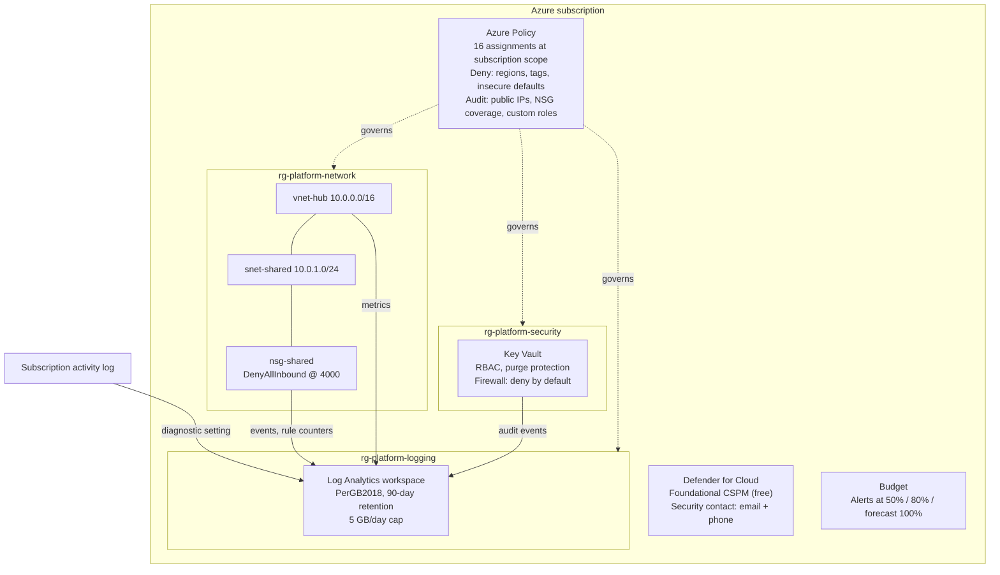

# 01 Secure Landing Zone

> Status: In progress (code passes CI; awaiting first sandbox deployment)
> Clouds: Azure (Bicep, Terraform)
> Last validated: not yet deployed

## In plain terms

**What this protects you from:** a cloud setup with no structure, no guardrails, and nobody sure who changed what. Without a landing zone, every new resource is a one-off decision made under time pressure, and the environment slowly becomes something nobody can explain or safely change.

**What it costs to run:** about **$5 to $65 per month** for a typical small organization, almost all of it log storage. The exact figure depends on how much your systems log; see the [cost breakdown](#9-cost-breakdown) for the assumptions.

**What you get:**

- A clear structure: three platform resource groups with a consistent naming convention, so anyone can tell what a resource is for by its name
- A permanent record of every change made in the subscription, kept for 90 days in one searchable place
- Guardrails that stop the most common mistakes before they happen: resources in the wrong region, missing ownership tags, insecure storage settings, and obsolete resource types
- A private network with a locked-down default, ready for servers or private endpoints later
- A secure place for platform secrets, with every access logged
- Security alerts and budget alerts that reach a named person by email, with a phone number on file for critical issues
- A monthly spending cap that warns you at 50 percent, 80 percent, and when the forecast exceeds 100 percent

Every other Groundwork pattern deploys into this one.

---

## 1. Overview

**Business objective.** Give a 50 to 500 person organization a cloud foundation that is secure by default, explainable to a non-technical owner, and cheap enough to run before any workload exists. The landing zone exists so that the first real workload (a file server, a line-of-business app, a backup target) lands somewhere governed rather than somewhere improvised.

**What gets deployed.** Into a single Azure subscription:

| Area | Resources |
|---|---|
| Structure | 3 resource groups: `rg-platform-logging`, `rg-platform-network`, `rg-platform-security` |
| Logging | 1 Log Analytics workspace (90-day retention, 5 GB/day cap); subscription activity log diagnostic setting |
| Governance | 16 Azure Policy assignments (built-in definitions only), 3 managed identities for tag inheritance, 3 role assignments |
| Network | 1 hub virtual network (`10.0.0.0/16`), 1 shared subnet (`10.0.1.0/24`), 1 default-deny NSG, diagnostics to the workspace |
| Secrets | 1 Key Vault (RBAC model, purge protection, firewall default-deny), diagnostics to the workspace |
| Security | Defender for Cloud foundational CSPM (free tier), 1 security contact |
| Cost | 1 subscription budget with three alert thresholds |

**Architecture.** A single-subscription design. All platform services share one Log Analytics workspace. Policy is assigned at the subscription scope so it applies to every future resource group automatically. The hub network reserves address space for a VPN gateway and Azure Bastion without deploying either, so they can be added later without re-addressing anything.



---

## 2. Prerequisites

| Requirement | Detail |
|---|---|
| Azure subscription | One subscription. The deploying identity needs **Owner** at subscription scope (policy assignments with managed identities create role assignments, which Contributor cannot do). |
| Resource providers | `Microsoft.Security`, `Microsoft.Consumption`, `Microsoft.PolicyInsights`, `Microsoft.OperationalInsights`, `Microsoft.KeyVault`, `Microsoft.Network`, `Microsoft.Insights`. Register with `az provider register --namespace <name>` if `az provider show --namespace <name> --query registrationState` is not `Registered`. |
| Azure CLI | 2.60 or later. `az version` |
| Bicep CLI (Bicep path) | 0.30 or later. `az bicep install` then `az bicep version` |
| Terraform (Terraform path) | 1.9 or later, with the `hashicorp/azurerm` provider 4.x (downloaded by `terraform init`). |
| Permissions and roles | Owner on the subscription for the deploying user or service principal. |
| App registrations and API scopes | None. |
| Environment variables | None required. Terraform reads your Azure CLI login. |
| DNS or networking | None. The hub network is self-contained. The `hub_address_space` must not overlap any on-premises range you may later connect. |
| Information to have ready | Organization code (2 to 8 lowercase characters), security contact email and phone, monthly budget amount, allowed regions, optional office egress IP for Key Vault access. |

**Terraform state.** State contains resource IDs and must never be committed. For a first sandbox run, local state is acceptable. For anything you will keep, create a storage account outside this pattern and configure the `azurerm` backend in `terraform/versions.tf` before the first `init`.

## 3. Folder structure

```text
01-landing-zone/
├── README.md                          This guide
├── bicep/
│   ├── main.bicep                     Subscription-scope entry point
│   └── modules/
│       ├── logging.bicep              Log Analytics workspace
│       ├── activity-log.bicep         Subscription activity log export
│       ├── policy.bicep               16 policy assignments + tag inheritance identities
│       ├── network.bicep              Hub VNet, shared subnet, NSG, diagnostics
│       ├── keyvault.bicep             Platform Key Vault + diagnostics
│       ├── security.bicep             Defender CSPM + security contact
│       └── budget.bicep               Subscription budget
├── terraform/
│   ├── versions.tf                    Provider pins, backend placeholder, provider features
│   ├── variables.tf                   Inputs with validation
│   ├── locals.tf                      Naming, tags, policy definition IDs
│   ├── main.tf                        Resource groups, logging, network, Key Vault, security, budget
│   ├── policy.tf                      Policy assignments
│   └── outputs.tf
├── examples/
│   ├── main.example.bicepparam        Example Bicep parameters (fictional values)
│   └── terraform.example.tfvars       Example Terraform variables (fictional values)
└── diagrams/                          Reserved for exported diagrams; the source is the Mermaid block above
```

**Secret injection points.** None. This pattern creates a Key Vault but stores nothing in it. Deployment credentials come from your Azure CLI login or, in CI, from OIDC federation. No file in this folder should ever contain a secret.

## 4. Deploy from zero

Both paths produce the same result. Pick one; do not run both against the same subscription.

### Before either path

```bash
# 1. Sign in and select the target subscription
az login
az account set --subscription "<subscription name or ID>"
az account show --query "{name:name, id:id}" -o table

# 2. Confirm you hold Owner at subscription scope
az role assignment list --assignee "$(az ad signed-in-user show --query id -o tsv)" \
  --scope "/subscriptions/$(az account show --query id -o tsv)" \
  --query "[].roleDefinitionName" -o tsv
# Expected output includes: Owner

# 3. Register resource providers (idempotent; safe to re-run)
for ns in Microsoft.Security Microsoft.Consumption Microsoft.PolicyInsights \
          Microsoft.OperationalInsights Microsoft.KeyVault Microsoft.Network Microsoft.Insights; do
  az provider register --namespace "$ns"
done

# 4. Clone the repository and enter the pattern
git clone https://github.com/IndigoWave-Tech/groundwork.git
cd groundwork/patterns/01-landing-zone
```

### Option A: Bicep

```bash
# 5. Create your parameter file from the example. The .local. name is git-ignored.
cp examples/main.example.bicepparam main.local.bicepparam

# 6. Edit main.local.bicepparam and replace EVERY value.
#    orgCode, environment, location, allowedLocations, tags, securityContactEmail,
#    securityContactPhone, monthlyBudgetAmount. Leave network defaults unless they
#    overlap a range you plan to connect.

# 7. Preview what will change. Read the output; nothing should be unexpected.
az deployment sub what-if \
  --name groundwork-lz \
  --location <your primary region> \
  --template-file bicep/main.bicep \
  --parameters main.local.bicepparam

# 8. Deploy. Takes roughly 5 to 8 minutes.
az deployment sub create \
  --name groundwork-lz \
  --location <your primary region> \
  --template-file bicep/main.bicep \
  --parameters main.local.bicepparam

# 9. Capture the outputs for the next pattern
az deployment sub show --name groundwork-lz --query properties.outputs -o json
```

### Option B: Terraform

```bash
# 5. Create your variables file from the example. terraform.tfvars is git-ignored.
cp examples/terraform.example.tfvars terraform/terraform.tfvars

# 6. Edit terraform/terraform.tfvars and replace EVERY value (same list as above).

# 7. Initialise. For a kept environment, configure the backend in versions.tf first.
cd terraform
terraform init

# 8. Preview. Expect roughly 45 resources to add, 0 to change, 0 to destroy.
terraform plan -out=lz.tfplan

# 9. Apply the reviewed plan. Takes roughly 5 to 8 minutes.
terraform apply lz.tfplan

# 10. Capture the outputs for the next pattern
terraform output -json
```

**If the Key Vault step fails with a name conflict:** Key Vault names are global. The name includes a hash of your subscription ID, so collisions are rare, but a soft-deleted vault with the same name from an earlier attempt will block creation. Run `az keyvault list-deleted -o table`, then either wait for the retention period or use a different `orgCode`.

## 5. Validation checklist

Run these after deployment. Each check is observable; if one fails, the deployment is not done.

- [ ] **Resource groups exist with tags.** `az group list --query "[?starts_with(name,'rg-platform-')].{name:name, owner:tags.owner, env:tags.environment, cc:tags.costCenter}" -o table` shows three rows with all three tags populated.
- [ ] **Policy is enforcing.** `az policy assignment list --query "[?starts_with(name,'lz-')].{name:name, mode:enforcementMode}" -o table` shows 16 rows, all `Default`.
- [ ] **A denied region is actually denied.** `az group create --name rg-test-deny --location <a region NOT in allowedLocations> --tags owner=test environment=test costCenter=test` fails with `RequestDisallowedByPolicy`. If it succeeds, policy has not propagated yet (wait 10 minutes) or the assignment is wrong.
- [ ] **A missing tag is actually denied.** `az group create --name rg-test-deny --location <allowed region>` (no tags) fails with `RequestDisallowedByPolicy`.
- [ ] **Activity log reaches the workspace.** In the portal, open the Log Analytics workspace, run `AzureActivity | take 10`. Rows appear within 15 minutes of deployment. (The deployment itself generates activity.)
- [ ] **NSG is attached and denying.** `az network vnet subnet show -g rg-platform-network-<suffix> --vnet-name vnet-hub-<suffix> -n snet-shared --query networkSecurityGroup.id -o tsv` returns the NSG ID. `az network nsg rule list -g rg-platform-network-<suffix> --nsg-name nsg-shared-<suffix> --query "[?name=='DenyAllInbound'].priority" -o tsv` returns `4000`.
- [ ] **Key Vault is locked down.** `az keyvault show -n <keyVaultName> --query "{rbac:properties.enableRbacAuthorization, purge:properties.enablePurgeProtection, default:properties.networkAcls.defaultAction}" -o table` shows `True`, `True`, `Deny`.
- [ ] **Key Vault access is denied from an unlisted IP.** `az keyvault secret list --vault-name <keyVaultName>` from a machine not in `keyVaultAllowedIpRanges` fails with `ForbiddenByFirewall`. This is the expected result.
- [ ] **Security contact is set.** `az security contact list --query "[].{email:emails, phone:phone}" -o table` shows your contact.
- [ ] **Budget exists.** `az consumption budget list --query "[].{name:name, amount:amount}" -o table` shows the budget at your amount.
- [ ] **Compliance view populates.** Within 30 minutes, Azure Portal > Policy > Compliance lists the `lz-` assignments. Initial state for the Audit assignments may be Non-compliant if the subscription already had resources; that is information, not a failure.

## 6. Teardown

Teardown order matters because of purge protection and policy.

```bash
# 1. Remove policy assignments first, or they may block cleanup of other resources.
for a in $(az policy assignment list --query "[?starts_with(name,'lz-')].name" -o tsv); do
  az policy assignment delete --name "$a"
done

# 2. Delete the budget and security contact (subscription-level, not in a resource group).
az consumption budget delete --budget-name budget-subscription-<suffix>
az security contact delete --name default

# 3. Delete the activity log diagnostic setting.
az monitor diagnostic-settings subscription delete --name send-activity-log-to-workspace --yes

# 4. Delete the resource groups. Key Vault goes to soft-deleted state (90 days).
az group delete --name rg-platform-security-<suffix> --yes --no-wait
az group delete --name rg-platform-network-<suffix>  --yes --no-wait
az group delete --name rg-platform-logging-<suffix>  --yes --no-wait

# 5. Role assignments for the deleted tag-inheritance identities remain as orphans. Remove them.
az role assignment list --query "[?principalName=='' && roleDefinitionName=='Tag Contributor'].id" -o tsv \
  | xargs -r -n1 az role assignment delete --ids
```

**Terraform path:** `terraform destroy` handles steps 1 through 5. Because `prevent_deletion_if_contains_resources` is on, destroy will stop if something outside this configuration was created in a platform resource group; remove it first, deliberately.

**Purge protection.** The Key Vault cannot be purged for 90 days after deletion. This is intentional and cannot be overridden by this pattern. If you redeploy within 90 days with the same `orgCode`, recovery of the soft-deleted vault happens automatically on the Terraform path (`recover_soft_deleted_key_vaults = true`); on the Bicep path, run `az keyvault recover --name <keyVaultName>` first.

## 7. Design decisions

| Decision | Chosen | Rejected | Why |
|---|---|---|---|
| Scope | Single subscription | Management group hierarchy (Enterprise-Scale / ALZ) | Most organizations in the target range have one subscription and no platform team. A management group tree adds a layer nobody will operate. The pattern can be re-pointed at a management group later if the organization grows into it. |
| Policy effects | Deny for regions, tags, HTTPS and purge protection; Audit for everything else | Deny everywhere | Deny on an existing subscription breaks running deployments. Audit first shows the drift; move each to Deny once the compliance view is clean. The region and tag denies are safe on day one because they only affect new resource groups and resources. |
| Policy definitions | Built-in only | Custom definitions | Built-ins are maintained by Microsoft, understood by auditors, and need no explanation in a handover. Custom definitions are a maintenance liability for a small team. |
| Tag enforcement | Require 3 tags on resource groups, inherit to resources | Require tags on every resource | Requiring tags on individual resources breaks many portal and marketplace deployments. Requiring them on the resource group and inheriting gets the same cost visibility with far less friction. |
| Log retention | 90 days interactive | 30 days (cheaper) or 365 days (compliance) | 90 days covers the "what happened last quarter" question without paying for a year. Organizations with a regulatory retention requirement should raise it and budget for it. |
| Daily ingestion cap | 5 GB/day | No cap | A runaway log source can cost hundreds of dollars overnight. 5 GB/day is well above normal for this audience; raising it is a deliberate, visible act. |
| Hub network | Deployed, with address space reserved for gateway and Bastion | Not deployed until needed; or full hub with Azure Firewall | A VNet is free and re-addressing later is painful, so plan the space now. Azure Firewall costs roughly $900 per month and is not justified before there is traffic to inspect. |
| NSG default | Explicit DenyAllInbound at priority 4000 | Rely on Azure default rules | Azure's defaults allow inbound from the internet to any public IP in the subnet. An explicit deny makes the intent visible and survives someone adding a public IP later. |
| Key Vault network access | Public endpoint, firewall default-deny, trusted Azure services bypass, optional IP allow-list | Private endpoint only (disable public access) | Private endpoints require a connected network (VPN, ExpressRoute, or a jump host) to use the vault at all. Most small organizations do not have that yet. Deny-by-default with a short IP list is the strongest posture that stays usable. Revisit when a VPN or Bastion exists. |
| Key Vault permission model | RBAC | Access policies | Access policies are the legacy model, bypass Azure RBAC, and are harder to audit. RBAC is the current Microsoft recommendation. |
| Defender for Cloud | Foundational CSPM (free) only | Enable paid plans (Servers, Storage, Key Vault) | Paid plans are priced per resource and belong with the pattern that deploys the resource. Enabling them with nothing to protect is spend without benefit. The security contact is configured now so alerts have somewhere to go when plans are enabled. |
| Budget | One subscription budget, email alerts | Action groups, cost anomaly alerts, per-resource-group budgets | This is the minimum safety net. Pattern 05 (Cost Guardrails) builds the full picture. Adding it here would duplicate that pattern. |
| RBAC assignments for people | None | Assign Reader or Contributor to Entra groups | Identity is Pattern 03. Hard-coding group object IDs here would make the landing zone environment-specific and couple two patterns that should ship independently. |
| Naming | `<type>-<org>-<workload>-<env>-<region>` with a 12-region short-code map | Microsoft CAF abbreviations only | CAF resource type abbreviations are followed; the region map is explicit so names stay readable. Unknown regions fall back to the first four characters. |
| Terraform provider features | `prevent_deletion_if_contains_resources = true`, no Key Vault purge on destroy | Provider defaults | Both defaults favour convenience over safety. A landing zone should fail loudly before deleting something it did not create. |

## 8. Security model

- **Identity and access.** The deploying identity needs Owner once, at deployment time. The pattern creates three system-assigned managed identities (one per tag-inheritance policy) scoped to Tag Contributor only. No user or group assignments are created; see Pattern 03.
- **Secrets.** None are created, stored, or required. The Key Vault is empty on delivery. Deployment authenticates through Azure CLI or OIDC federation in CI, never through a stored credential.
- **Network.** The shared subnet denies all inbound by default. No public IPs, gateways, or peering are created.
- **Logging and audit trail.** The subscription activity log (every control-plane action, with caller identity) and Key Vault audit events (every data-plane access attempt) are retained for 90 days in the workspace. NSG events and rule counters are retained for traffic analysis.
- **Data protection.** Key Vault soft delete (90 days) and purge protection are on and cannot be disabled after creation. Policy denies storage accounts without HTTPS and key vaults without purge protection anywhere in the subscription.
- **Known gaps, by design.** No Defender paid plans, no private endpoints, no Sentinel, no Bastion, no VPN. Each is a later pattern or a per-workload decision, and each is recorded in the design decisions table above.

## 9. Cost breakdown

| Resource | SKU or tier | Estimated monthly cost | Assumption |
|---|---|---|---|
| Log Analytics ingestion | PerGB2018 | $0 to $58 | $2.30/GB after the first 5 GB per month free. $0 at under 170 MB/day; $58 at 1 GB/day (30 GB, 25 billable). |
| Log Analytics retention beyond 31 days | Interactive | $0 to $6 | $0.10/GB/month for days 32 to 90. About $6 at 1 GB/day. |
| Key Vault | Standard | under $1 | $0.03 per 10,000 operations. A platform vault with no workloads sees very few. |
| Virtual network, subnet, NSG | n/a | $0 | No charge for the resources themselves. Peering and gateways, not deployed here, would add cost. |
| Azure Policy | n/a | $0 | Built-in policy evaluation is free. |
| Defender for Cloud | Foundational CSPM | $0 | Free tier. |
| Budget | n/a | $0 | Free. |
| Activity log export | n/a | $0 | Activity log ingestion to Log Analytics is not billed. |
| **Total** | | **about $5 to $65** | Low end: a quiet subscription with little beyond the activity log. High end: 1 GB/day of diagnostics. |
| Worst case under the daily cap | | about $365 | 5 GB/day sustained all month. The cap exists so this is the ceiling, not an open-ended bill. |

Estimate method: list prices for US regions as published on Azure Monitor pricing, checked 2026-09-30. Prices vary by region and change over time. Your Azure invoice is the source of truth; the budget alert exists so you see drift before the invoice does.

## 10. Production readiness

- [x] CI checks pass (Bicep build and lint with zero warnings, Checkov with documented skips, Terraform fmt, TFLint)
- [ ] Terraform validate against provider schemas (runs in GitHub Actions on pull request)
- [ ] Deployed to a sandbox subscription (Bicep path)
- [ ] Deployed to a sandbox subscription (Terraform path)
- [ ] Validation checklist completed against both deployments
- [ ] Torn down cleanly with no orphaned resources
- [ ] Cost estimate confirmed against the sandbox invoice after 30 days

The pattern moves to **Ready** when every box is checked.

## Changelog

| Date | Change |
|---|---|
| 2026-09-30 | Initial build: Bicep and Terraform implementations, guide, CI passing |
