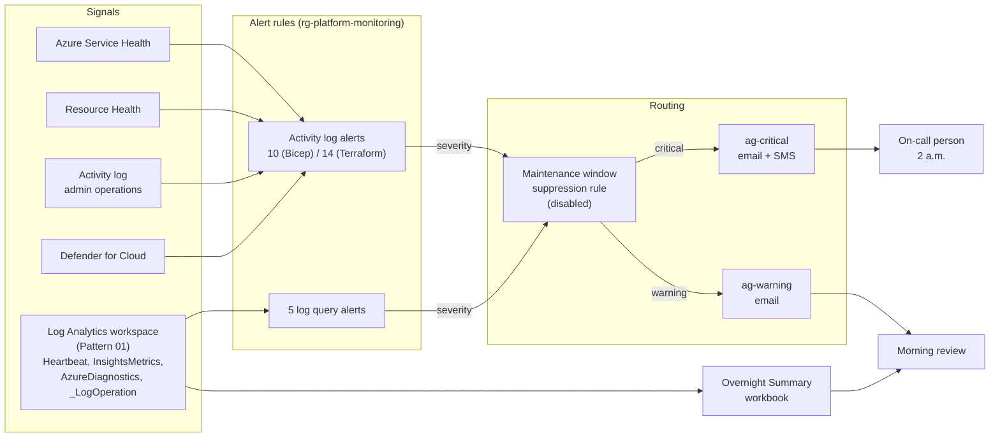

# 02 Overnight Watch

> Status: In progress (code passes CI; awaiting first sandbox deployment)
> Clouds: Azure (Bicep, Terraform)
> Requires: Pattern 01 Secure Landing Zone (uses its Log Analytics workspace)
> Last validated: not yet deployed

## In plain terms

**What this protects you from:** problems that start at 2 a.m. and are only discovered when staff arrive. A server that stopped overnight, a disk that filled up, an Azure outage in your region, or someone quietly changing permissions at midnight. Without this, the first alarm is a phone call from an employee who cannot work.

**What it costs to run:** about **$1 to $10 per month**. Most of the alerting is free; the cost is a few dollars for the log query rules and any SMS messages beyond the free allowance. See the [cost breakdown](#9-cost-breakdown).

**What you get:**

- Two levels of alert. **Critical** means something is down or at risk right now, and a named person gets an email and a text. **Warning** means something needs attention in the morning, and it goes to email only. If everything pages, nothing does.
- Notice when Azure itself has a problem in your region, before your users tell you
- Notice when a machine stops reporting, a disk is nearly full, or a resource becomes unavailable
- Notice when someone deletes a resource group, deletes a Key Vault, changes who has access, removes a guardrail, or changes the network boundary
- A one-screen morning summary: what changed, who changed it, what fired, which machines are healthy, and what is filling the logs
- A pre-built "maintenance mode" switch so planned patching does not generate a night of false alarms

Automation does the watching. A person responds only to escalations.

---

## 1. Overview

**Business objective.** Replace "we found out when someone complained" with "we knew before anyone noticed". For a 50 to 500 person organization without a night shift, the only affordable overnight coverage is automation that watches and a clear rule about when to wake someone up.

**What gets deployed.** Into a single Azure subscription that already has Pattern 01:

| Area | Resources |
|---|---|
| Routing | 2 action groups: `ag-critical` (email + optional SMS), `ag-warning` (email) |
| Platform health | 3 activity log alerts: service incidents, service maintenance, resource health |
| Change detection | 6 activity log alerts (Bicep) / 10 (Terraform, same coverage, see decisions): resource group deleted, Key Vault deleted, role assignment changed, policy assignment deleted, NSG or rule changed, diagnostic setting deleted |
| Security | 1 activity log alert: Defender for Cloud security alerts |
| Workload health | 5 log query alerts against the workspace: VM heartbeat missing, all heartbeats stopped, low disk space, repeated Key Vault denials, daily ingestion cap reached |
| Maintenance | 1 alert processing rule (suppression), deployed disabled |
| Review | 1 workbook: Overnight Summary |

All of it lives in a new `rg-platform-monitoring` resource group.

**Architecture.** Everything funnels through two action groups. Alert rules decide severity; action groups decide who hears about it. Activity log alerts need no agent and work the moment they are deployed. Log query alerts read the central workspace from Pattern 01 and automatically cover any machine that is later onboarded to it, so adding a server never means adding alert rules.



### The alert catalog

| Alert | Fires when | Severity | Why this severity |
|---|---|---|---|
| Service health incident | Azure reports an incident or security advisory in one of your regions | Critical | You cannot fix it, but you need to know before users call so you can communicate |
| Service health maintenance | Azure announces planned maintenance, action required, or an advisory | Warning | Plan for it in the morning |
| Resource health unavailable | A resource is Unavailable or Degraded, platform or user initiated | Critical | Something is down |
| Resource group deleted | Any resource group deletion succeeds | Critical | Everything in it is gone; if unexpected, this is an incident |
| Key Vault deleted | Any Key Vault deletion succeeds | Critical | Soft delete protects the data, but secrets are now unreachable |
| Role assignment changed | A role is granted or removed | Warning | Legitimate often, but every one should be explainable |
| Policy assignment deleted | A policy assignment is removed | Warning | A landing zone guardrail may be gone |
| NSG or rule changed | Any NSG or security rule write or delete | Warning | The network boundary moved |
| Diagnostic setting deleted | Any diagnostic setting is removed | Warning | Something stopped logging |
| Defender security alert | Defender for Cloud raises an alert | Critical | Treat every security alert as real until proven otherwise |
| VM heartbeat missing | A machine has not reported for 10 minutes (configurable) | Critical | The machine is off, disconnected, or the agent died |
| All heartbeats stopped | Machines that reported in the last day have all gone silent for 30 minutes | Critical | The workspace or agent configuration broke, not one machine |
| Low disk space | A disk is below 10 percent free (configurable) for two consecutive checks | Warning | Full disks take services down, but there is usually time |
| Key Vault access denied | More than 10 denied requests to one vault from one IP in 15 minutes | Warning | A broken application or someone probing |
| Daily cap reached | The workspace hit its ingestion cap and is dropping logs | Warning (severity 1) | You are blind until midnight UTC; find the noisy source |

## 2. Prerequisites

| Requirement | Detail |
|---|---|
| Pattern 01 deployed | This pattern needs the Log Analytics workspace resource ID from Pattern 01's outputs. |
| Azure subscription | The deploying identity needs **Contributor** at subscription scope (no role assignments are created here, so Owner is not required). |
| Resource providers | `Microsoft.Insights`, `Microsoft.AlertsManagement`, `Microsoft.OperationalInsights`. Register with `az provider register --namespace <name>`. |
| Azure CLI | 2.60 or later. |
| Bicep CLI (Bicep path) | 0.30 or later. |
| Terraform (Terraform path) | 1.9 or later, `hashicorp/azurerm` 4.x. |
| App registrations and API scopes | None. |
| Environment variables | None. |
| DNS or networking | None. |
| Information to have ready | Workspace resource ID; who is on call (email and mobile number); who reviews warnings; the display names of your Azure regions (for example `East US 2`, not `eastus2`). |
| For VM alerts to produce data | Virtual machines must run the Azure Monitor Agent with VM Insights enabled, sending to the Pattern 01 workspace. This pattern does not onboard machines; the pattern that deploys a machine does. |

## 3. Folder structure

```text
02-monitoring-alerting/
├── README.md                          This guide
├── bicep/
│   ├── main.bicep                     Subscription-scope entry point
│   └── modules/
│       ├── action-groups.bicep        Critical and warning action groups
│       ├── activity-alerts.bicep      Service health, resource health, admin changes, Defender
│       ├── log-alerts.bicep           Five scheduled query rules
│       ├── suppression.bicep          Disabled maintenance window rule
│       └── workbook.bicep             Overnight Summary workbook
├── terraform/
│   ├── versions.tf                    Provider pins
│   ├── variables.tf                   Inputs with validation
│   ├── locals.tf                      Naming, tags
│   ├── main.tf                        Resource group, action groups, suppression, workbook
│   ├── activity-alerts.tf             Activity log alerts (for_each over a catalog)
│   ├── log-alerts.tf                  Scheduled query rules (for_each over a catalog)
│   └── outputs.tf
├── workbook/
│   └── overnight-summary.json         Workbook definition, shared by both paths
├── examples/
│   ├── main.example.bicepparam
│   └── terraform.example.tfvars
└── diagrams/
```

**Secret injection points.** None. Email addresses and phone numbers in action groups are contact details, not secrets, but they are environment-specific and belong only in your local parameter file.

## 4. Deploy from zero

### Before either path

```bash
az login
az account set --subscription "<subscription name or ID>"

for ns in Microsoft.Insights Microsoft.AlertsManagement Microsoft.OperationalInsights; do
  az provider register --namespace "$ns"
done

# Get the workspace ID from Pattern 01
az deployment sub show --name groundwork-lz \
  --query properties.outputs.logAnalyticsWorkspaceId.value -o tsv
# or, on the Terraform path:  terraform -chdir=../01-landing-zone/terraform output -raw log_analytics_workspace_id

cd groundwork/patterns/02-monitoring-alerting
```

### Option A: Bicep

```bash
cp examples/main.example.bicepparam main.local.bicepparam
# Edit main.local.bicepparam: workspaceResourceId, criticalEmails, criticalSmsReceivers,
# warningEmails, serviceHealthRegions (display names), and the org/env/location to match Pattern 01.

az deployment sub what-if \
  --name groundwork-ow \
  --location <your primary region> \
  --template-file bicep/main.bicep \
  --parameters main.local.bicepparam

az deployment sub create \
  --name groundwork-ow \
  --location <your primary region> \
  --template-file bicep/main.bicep \
  --parameters main.local.bicepparam
```

### Option B: Terraform

```bash
cp examples/terraform.example.tfvars terraform/terraform.tfvars
# Edit terraform/terraform.tfvars with the same values.

cd terraform
terraform init
terraform plan -out=ow.tfplan      # Expect roughly 21 resources to add
terraform apply ow.tfplan
```

**Confirm the SMS subscription.** Azure sends a confirmation text to each SMS recipient. Until they reply, SMS is not delivered. Check in the portal under the action group's SMS receiver status.

## 5. Validation checklist

- [ ] **Action groups exist with the right receivers.** `az monitor action-group list -g rg-platform-monitoring-<suffix> --query "[].{name:name, emails:length(emailReceivers), sms:length(smsReceivers)}" -o table` shows `critical` with your counts and `warning` with email only.
- [ ] **Test notification reaches the on-call person.** In the portal, open `ag-critical-<suffix>` and use **Test action group** with a sample Activity Log alert. Confirm the email arrives and the SMS arrives. Do the same for `ag-warning`.
- [ ] **All activity log alerts are enabled.** `az monitor activity-log alert list -g rg-platform-monitoring-<suffix> --query "[].{name:name, enabled:enabled}" -o table` shows every `ow-` rule as `True`.
- [ ] **A real change triggers an alert.** Create and delete a test NSG: `az network nsg create -g rg-platform-network-<suffix> -n nsg-ow-test -l <region> --tags owner=test environment=test costCenter=test` then `az network nsg delete -g rg-platform-network-<suffix> -n nsg-ow-test`. Within 5 minutes, the warning email for "NSG changed" arrives. (Policy from Pattern 01 requires the tags.)
- [ ] **Log query alerts are enabled and valid.** `az monitor scheduled-query list -g rg-platform-monitoring-<suffix> --query "[].{name:name, enabled:enabled, freq:evaluationFrequency}" -o table` shows five rules, all enabled. If deployment had failed query validation, they would not exist.
- [ ] **Suppression rule exists and is disabled.** `az monitor alert-processing-rule list -g rg-platform-monitoring-<suffix> --query "[].{name:name, enabled:properties.enabled}" -o table` shows `apr-maintenance-window-<suffix>` as `False`.
- [ ] **Workbook opens.** Portal > Monitor > Workbooks > Overnight Summary. Sections 2, 3 and 5 populate from Pattern 01's activity log and usage data. Sections 4 and 6 are empty until VMs or Key Vault traffic exist; that is expected.
- [ ] **Service health region names are right.** Open `ow-service-health-incident` in the portal and confirm the regions listed match where you actually run resources. A typo here means silence during an outage.

## 6. Teardown

```bash
# Everything lives in one resource group. Deleting it removes all alerts, action
# groups, the suppression rule, and the workbook. Nothing has soft delete.
az group delete --name rg-platform-monitoring-<suffix> --yes
```

**Terraform path:** `terraform destroy`.

Pattern 01's workspace is untouched; this pattern only reads from it.

## 7. Design decisions

| Decision | Chosen | Rejected | Why |
|---|---|---|---|
| Two severities | Critical (email + SMS) and Warning (email) | One action group; or four or five severity tiers | Two is the number a one-person IT function can honour. Critical means wake up; warning means morning. More tiers get ignored. |
| Activity log alerts first | 10 activity log alerts covering platform health and admin changes | Only log query alerts | Activity log alerts are free, need no agent, and work on an empty subscription. They are the day-one coverage. |
| Admin change alerts as Warning | Role, policy, NSG and diagnostics changes are Warning | Critical for all security-relevant changes | These are usually legitimate. Paging someone for every role assignment trains them to ignore pages. The exception is deletion of a resource group or Key Vault, which is Critical because it is rarely routine. |
| Resource Health scope | Subscription-wide, Unavailable or Degraded, any cause | Per-resource rules | One rule covers every current and future resource. Per-resource rules rot. |
| VM alerts via Heartbeat and InsightsMetrics | Workspace-scoped log query rules | Per-VM metric alerts | Workspace-scoped rules automatically cover every machine onboarded to the workspace. Adding a server never means adding alert rules, which is the only way a small team keeps coverage complete. The cost is a dependency on the Azure Monitor Agent. |
| Heartbeat threshold | 10 minutes, configurable | 5 minutes | Heartbeats arrive every minute; 10 minutes tolerates a reboot without paging. |
| Two heartbeat rules | Per-machine gap plus "everything went silent" | One rule | They point to different causes. One silent machine is a machine problem. Every machine silent is a workspace, agent or network problem, and the response is different. |
| Low disk at 10 percent, two consecutive checks | Warning | Critical, or 5 percent | At 10 percent there is time to act in the morning. Requiring two checks avoids paging on a transient temp file. |
| Key Vault denial threshold | More than 10 in 15 minutes, per vault per caller IP | Any denial | One denial is a typo. Ten from one address is a pattern. |
| Daily cap alert | Severity 1 warning | Critical | Nothing is down, but you are blind. It needs attention the same day, not at 2 a.m. |
| Suppression rule deployed disabled | One subscription-wide rule, no schedule | No rule; or a scheduled recurring window | A pre-built switch means the person patching at midnight flips a toggle instead of improvising. No schedule because maintenance windows vary; add one if yours is fixed. |
| Workbook over a dashboard | One shared workbook, definition in a JSON file both paths load | Azure dashboard; Grafana | Workbooks are free, versionable as JSON, and support KQL directly. Grafana is excellent and costs money with nothing yet to justify it. |
| Terraform activity alerts | 14 rules via `for_each`, one operation per rule | 10 rules matching Bicep exactly | The `azurerm` provider models one `operation_name` per criteria block, where ARM accepts `anyOf`. Splitting keeps the provider happy; coverage is identical. Both paths are documented as what they are. |
| No auto-remediation runbooks | Not included | Automation account with restart-on-heartbeat-loss runbook | Pattern 02's original scope listed remediation runbooks. They were removed: there are no workloads yet to remediate, a runbook that restarts machines unattended is a decision to make per workload, and building it now would be solving a problem that does not exist. It returns when a workload pattern needs it. |
| No Microsoft Sentinel | Not included | Sentinel on the workspace | Sentinel is a SIEM with per-GB pricing and needs someone to triage incidents. Right-sized for this audience later, not on day one. |

## 8. Security model

- **Identity and access.** No identities, role assignments, or secrets are created. Deployment needs Contributor.
- **Contact details.** Email addresses and phone numbers live in action groups, which anyone with Reader on the resource group can see. They are contact details, not credentials, but keep the parameter file out of version control.
- **Suppression rule risk.** An enabled suppression rule silences everything. The validation checklist confirms it is disabled; the Overnight Summary workbook shows alert activity so a stuck-on suppression would be visible as an unusually quiet night. Consider an activity log alert on `Microsoft.AlertsManagement/actionRules/write` if this concerns you.
- **Logging.** Alert rule changes are themselves activity log events and appear in the workbook's change list.

## 9. Cost breakdown

| Resource | Count | Estimated monthly cost | Assumption |
|---|---|---|---|
| Activity log alerts | 10 (Bicep) or 14 (Terraform) | $0 | Activity log alert rules are free to create and evaluate (Microsoft Learn, Azure Monitor alert types). |
| Log query alert rules | 5 | about $1 to $8 | Billed per rule by evaluation frequency; more frequent is more expensive. Three rules run every 15 or 30 minutes, two every 5 minutes. Treat this as an Assumption: confirm the per-rule rate for your region in the Azure pricing calculator. |
| Action groups | 2 | $0 | No charge for the groups themselves. |
| Email notifications | varies | $0 | First 1,000 emails per month are free (Microsoft Learn). A quiet month uses a handful. |
| SMS notifications | varies | $0 to a few dollars | Small per-message charge after a monthly free allowance; US rates. Critical alerts should be rare, so this is near zero unless something is badly wrong. |
| Alert processing rule | 1 | $0 | Free. |
| Workbook | 1 | $0 | Free. Queries run against data already paid for in Pattern 01. |
| **Total** | | **about $1 to $10** | Dominated by the log query rules. |

Estimate method: Microsoft Learn documentation on alert pricing categories and free quotas, checked 2026-10-01. Per-rule log alert rates were not confirmed from a primary source at time of writing and are marked as an Assumption. Your Azure invoice is the source of truth.

## 10. Production readiness

- [x] CI checks pass (Bicep build and lint with zero warnings, Terraform fmt, TFLint, Checkov)
- [ ] Terraform validate against provider schemas (runs in GitHub Actions on pull request)
- [ ] Deployed to a sandbox subscription (Bicep path)
- [ ] Deployed to a sandbox subscription (Terraform path)
- [ ] Test notifications received on both action groups, SMS confirmed
- [ ] Validation checklist completed, including the real NSG change test
- [ ] Torn down cleanly
- [ ] Per-rule log alert cost confirmed from the sandbox invoice

The pattern moves to **Ready** when every box is checked.

## Changelog

| Date | Change |
|---|---|
| 2026-10-01 | Initial build: Bicep and Terraform implementations, workbook, guide, CI passing. Auto-remediation runbooks removed from scope (see design decisions). |
